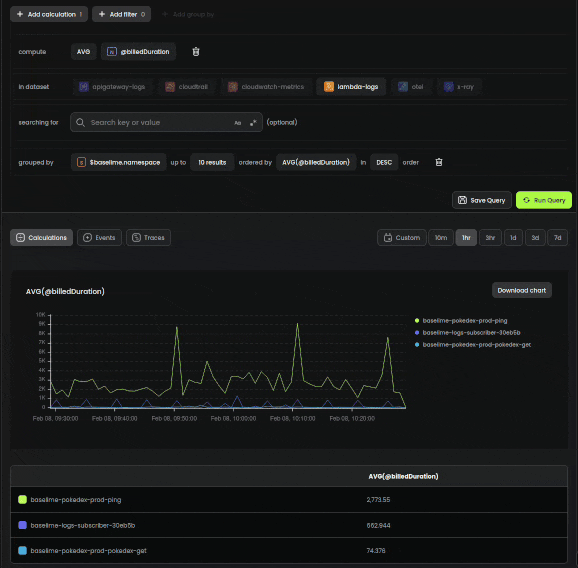

# Welcome to the Baselime Documentation

[Baselime](https://baselime.io) is an observability as code platform for serverless architectures. It helps developers collect, analyze, and understand the telemetry data generated by their serverless applications. With Baselime, you can:

- Ingest logs, metrics, traces, and other telemetry data from your serverless applications
- Use multiple interfaces to interact with your data, including a web console, a CLI, and a Visual Studio Code extension
- Integrate with tools you already use, such as GitHub, Slack, Jenkins, and PagerDuty

---


## What is Observability as Code?

Observability as code is the practice of treating the monitoring and debugging of an application as part of the application's codebase. This means that the configuration of monitoring and debugging tools is stored in version control and treated like any other code.

With observability as code, you can:

- Maintain a clear, up-to-date record of how your application is being monitored and debugged
- Collaborate with your team on monitoring and observability configuration
- Automate the configuration of monitoring and observability tools


Baselime is built on the OpenTelemetry observability framework, which provides a standard way to instrument applications for observability. With Baselime, you can easily implement Observability as Code in your serverless applications.

---

## What is Telemetry Data?

Telemetry data is information about the performance and behavior of an application. It includes:

- Logs: Recorded messages that provide information about the application's execution
- Metrics: Quantitative measurements of the application's performance, such as CPU usage or request latency
- Traces: Detailed records of the steps taken by the application as it processes a request
- All other data your application emits during at runtime, such as CloudTrail logs, internal event for EDAs, etc.

Collecting and analyzing telemetry data is essential for understanding the health and performance of an application. With Baselime, you can easily ingest and analyze telemetry data from your serverless applications.


---
## Guides

- [Quickstart](./getting-started/quick-start.md): Get up and running with Baselime in a few steps
- [Sending Data](./sending-data/overview.md): Learn how to ingest telemetry data from your serverless applications
- [Analyzing Data](./analysing-data/overview.md): Discover how to use the various interfaces provided by Baselime to analyze and understand your data
- [Integrations](./): Find out how to connect Baselime with your favorite tools


---
## Reference

- [Reference Guide](../observability-reference-language/overview.md): Learn about the Baselime Observability Reference Language (ORL) and how to use it to define observability configurations
- [CLI Reference](./cli/install.md): Complete reference for the Baselime command-line interface
- [API Reference](./api/auth.md): Detailed documentation of the Baselime API

---
## Community

Join the Baselime community to get help with using the platform, share your own experiences, and stay up-to-date with the latest developments.

- [Slack](https://join.slack.com/t/baselimecommunity/shared_invite/zt-1eu7l0ag1-wxYXQV6Fr_aiB3ZPm3LhDQ): Join our Slack community to connect with other Baselime users and get real-time support from the Baselime team
- [Blog](https://baselime.io/blog): Read about the latest features, best practices, and more from the Baselime team
- Social media: Follow us on [Twitter](https://twitter.com/baselimeHQ), [LinkedIn](https://www.linkedin.com/company/baselime), and [YouTube](https://youtube.com/baselimedev) to stay up-to-date with the latest news and updates from Baselime

We look forward to connecting with you!

---

```js # :icon-code: quick-start.js
if(baselime.use === "first-time") {
  return quickStart();
}
```
