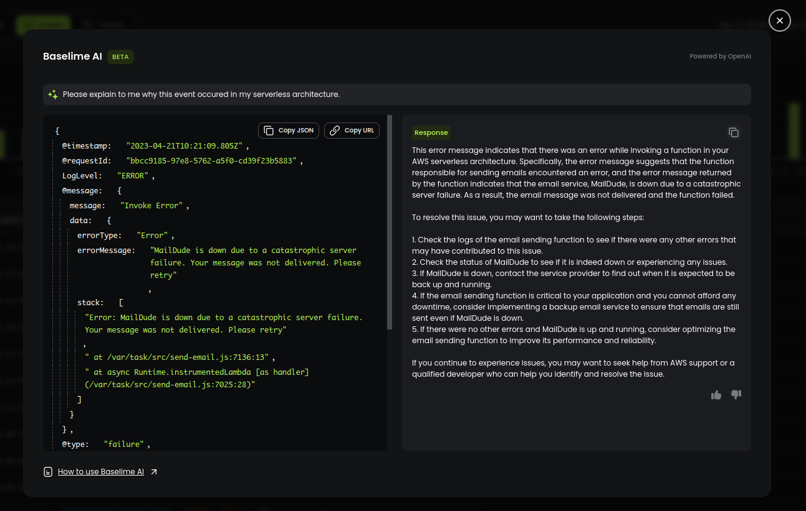
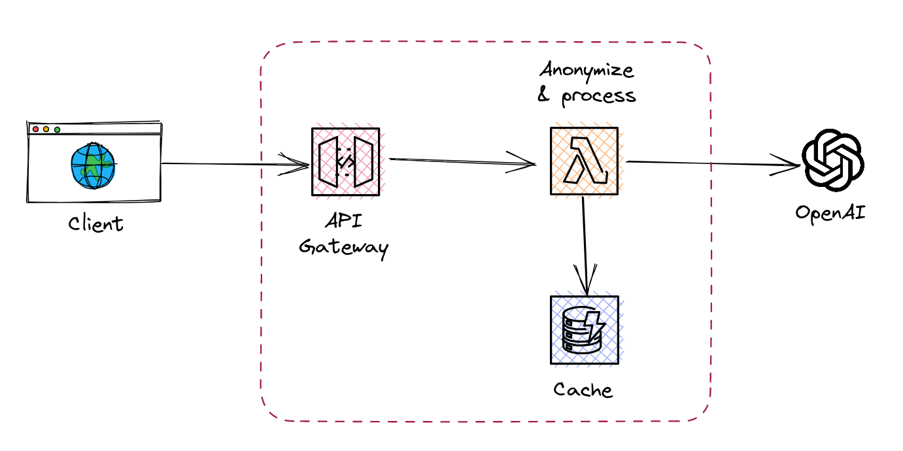

# Baselime AI

Baselime AI provides explanations for any chart, log, event, metric or trace on Baselime. It helps you easily identify patterns and anomalies in your serverless systems, providing deeper insights into your system performance and behavior.

---

## Getting Started

You’ll need a Baselime account to start using Baselime AI. If you don't have one already, you can quickly sign up for a free trial on our [website](https://console.baselime.io).

Once you have an account, follow these steps to use Baselime AI:

1. Navigate to the Baselime dashboard and select the chart, log, event, metric, or trace you want to analyze.
2. Click on the "Ask AI" button located next to the chart.
3. Wait for Baselime AI to process your query and provide a response.

---

## How it Works

Baselime AI is built using OpenAI's Large Language Models. When you ask Baselime AI a question, it analyzes the data in the selected chart or event, and uses machine learning algorithms to identify any anomalies or patterns.

Once Baselime AI has identified potential issues, it generates a response that explains the root cause of the problem, as well as any recommended actions to fix it. The response is presented in natural language, making it easy for developers of all skill levels to understand.

---

## Benefits

Baselime AI offers a range of benefits, including:

- Streamlined debugging: Baselime AI enables you to quickly and easily identify and fix issues, reducing the time and effort required for debugging.
- Improved system observability: With Baselime AI, you can gain deeper insights into your system performance and behavior, enabling you to optimize your systems and improve overall system observability.
- Accessible to all skill levels: Baselime AI's natural language explanations make it easy for developers at all skill levels to understand and interpret results.

---

## Privacy

Baselime is committed to protecting the privacy of our users' data. We understand the importance of keeping data secure and confidential, and we take appropriate measures to safeguard it.

When you use Baselime AI, your data is processed in accordance with our [privacy policy](https://baselime.io/privacy). Before any data is sent to OpenAI, it is completely anonymized to protect the privacy of our users. This is done through a process called [obfuscation](../security/privacy.md/#obfuscating-keys), which replaces identifiable information with obfuscated tokens.

Once data has been anonymized, it is sent to OpenAI for processing. OpenAI is a trusted provider of AI services, and we have taken steps to ensure that your data is processed in accordance with our privacy policy and our high standards for data security.

The diagram above shows a simplified overview of the data flow and privacy measures taken in Baselime AI. When you request an explanation for a chart, log, event, metric, or trace, the data is first processed and analyzed by Baselime AI. This analysis is done locally within our system to ensure that sensitive data is not transmitted. Only after data is anonymized through obfuscation is it sent to OpenAI for processing. OpenAI processes the data and returns an explanation to our system, which is then delivered to you.

We take data privacy seriously and are committed to ensuring that your data is protected at all times. If you have any questions or concerns about our privacy policy or data security, please don't hesitate to [contact us](https://join.slack.com/t/baselimecommunity/shared_invite/zt-1eu7l0ag1-wxYXQV6Fr_aiB3ZPm3LhDQ).
