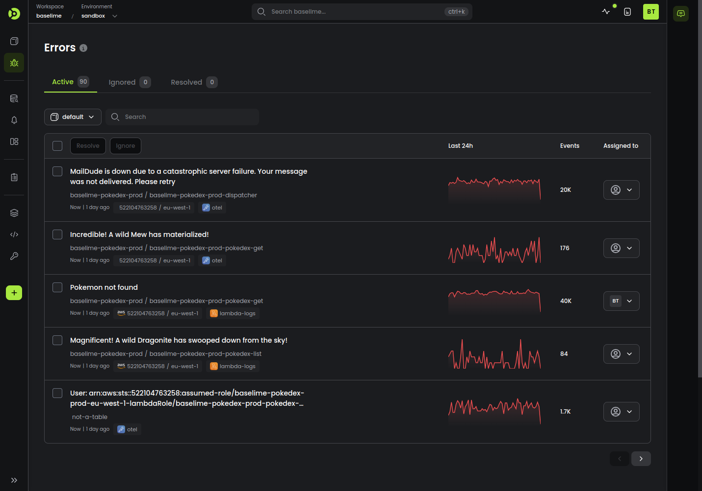
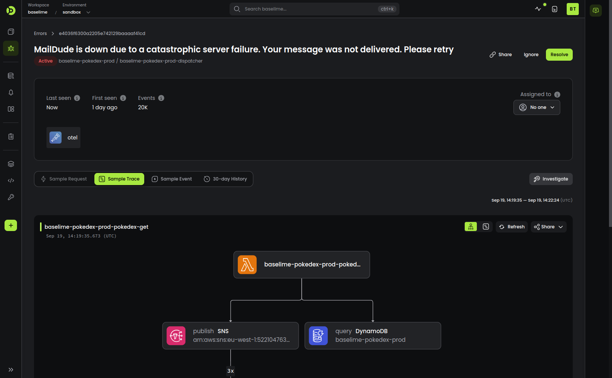

# Real-Time Error Tracking in Baselime

Baselime automatically tracks all errors occuring in your applications and notifies you with those that need your attention in real-time.

---

## Errors

The **Errors** page displays errors in your applications, across your services. You can filter errors by service or search using case-sensitive search.

When you connect your cloud account to Baselime, your applications send logs, metrics, traces and wide events to Baselime. On each event, Baselime determines if it's an error. This is typically determined by:
- The log level: anything above `error` or `critical` log level
- The status of the span: every span with an error (from OpenTelemetry)
- If the event has a root level property `level` set to `error` or `critical`.

Baselime then computes the fingerpring of the error. The fingerprit is based on multiple variables:

- `dataset`
- `service`
- `namespace`
- `account`
- `region`
- `level`
- `errorString`

Errors are uniquely represented by their fingerprint. Errors with a different set of the variables above are distinct errors. If a similar error with the same fingerpring occurs, you will not get notified, the occurences counter will increase instead.

The occurences counter is refreshed after 30 days since the first occurence of the error. If the error is not resolved or ignored within 30 days and occurs once more, you'll be notified.

---

## Error status

Errors can have a status in Baselime:
- **Active**
- **Ignored**
- **Resolved**

You can change the status of any error from the [Baselime console](https://console.baselime.io). The status reflects the behaviour of the error fingerprint when the same error is occurs again in your architecture.

### Active errors

This is the default status of all errors when they are detected. When an error in **Active** state occurs, you will get notified only the first time it happens. You will not not get notified again until the fingerprint expires 30 days after the first occurence of the error. As such, if the error is not resolved within 30 days and it occurs again, you will get notified.

### Ignored errors

When an error in **Ignored** state occurs, you will not get notified ever. This is useful for expected errors, where they occur in your applications, but no action is required.

### Resolved errors

When an error is marked as **Resolved**, you will get notified the first time it happens again, and it will be automatically marked as **Active**. This is helpful for when you have resolved an error in your applications, but it happens again for a set of edge-cases. You will know about it as soon as it happens again.

---

## Merging Errors

Baselime enables merging similar errors that have not automatically been grouped together. In the [Baselime console](https://console.baselime.io) you can merge multiple errors into a single one. Merged errors are not shown in the main list of errors and are available from within the error they are merged into.

---

## Deleting Errors

You can delete errors. When you delete an error, all its history is lost, and this action is irreversible. If the same error occurs again in the future, we will create a new Error for it and notify you as per your notification settings.

---

## Assigning Errors

You can assign an error to any of your member of your team to facilitate error triage.

---

## Error details

The error details page gives you an overview of the error and enables you to dig deeper into the data and understand why the error occured.

It displays the first and last time the error was seen in your telemetry datam the number of occurences in the past 30 days, the cloud account the error originates from, and the dataset. From this screen it is also possible to directly change the status of an error or assign it to a member of your team.

For each error, the errors details screen also displays:
- A sample request
- A sample trace
- A sample error event
- The 30-day History of occurences

From this screen you can click on the **Investigate** button to hop into the [query builder](./queries.md) to dig deeper in the issues.
