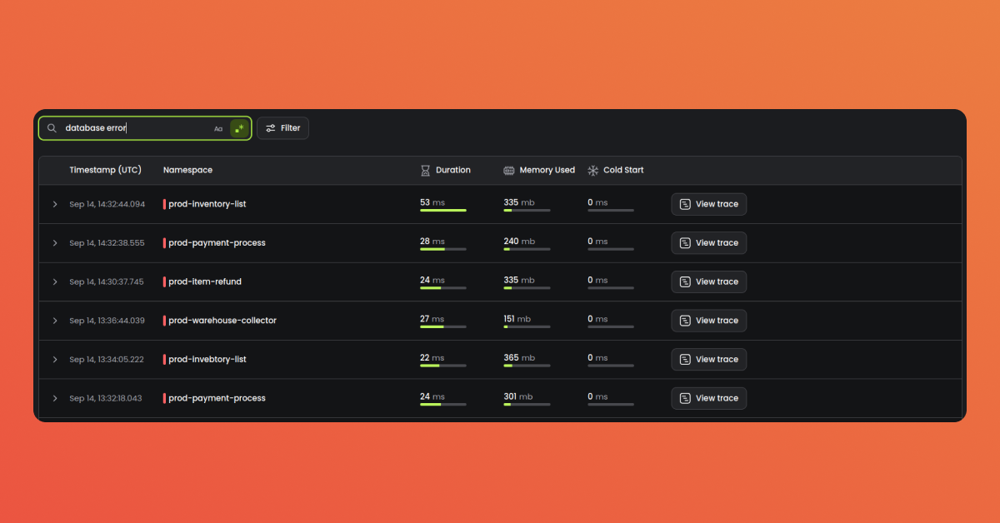
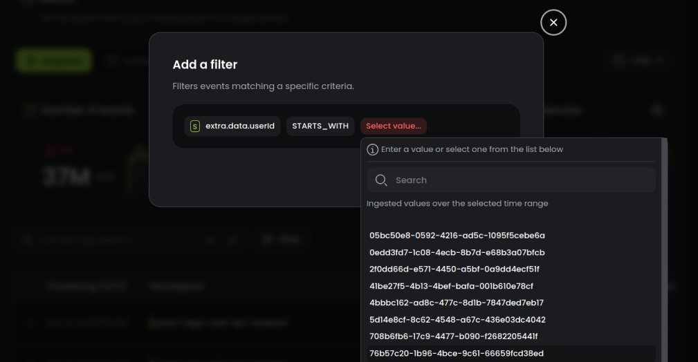
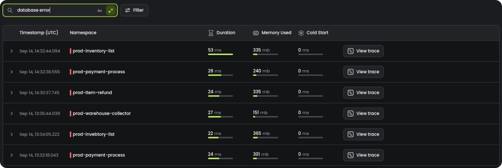
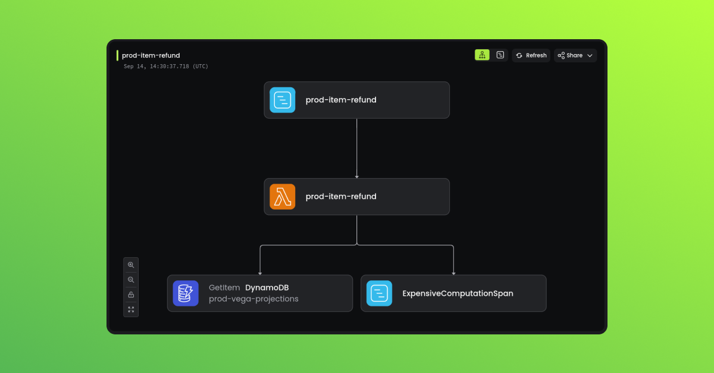
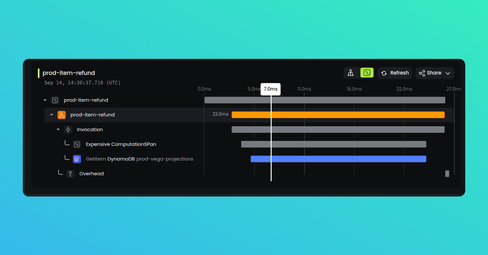
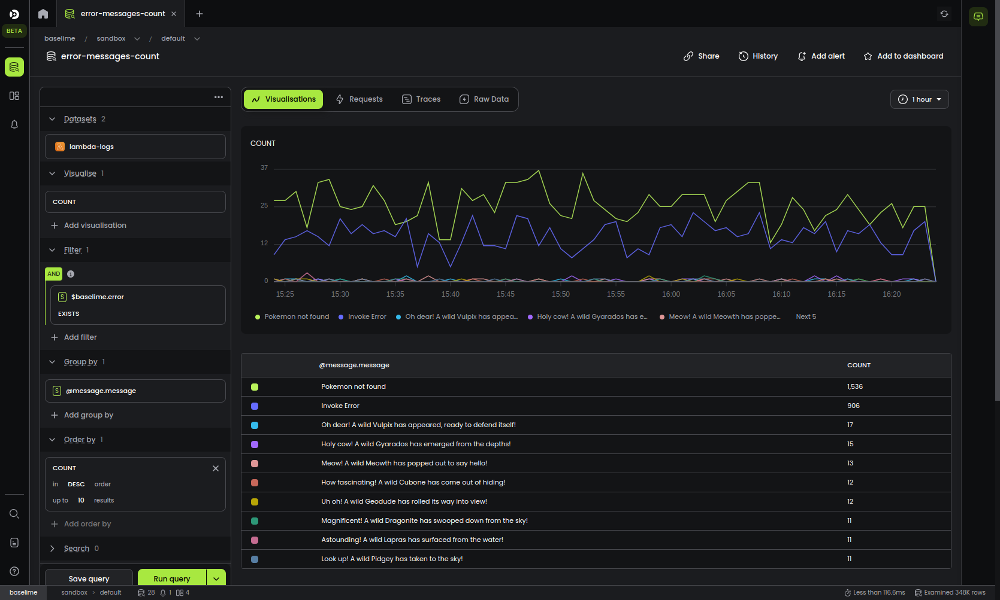

# Troubleshooting in Baselime

---

Baselime enables you to troubleshoot your systems and find issues faster. You can search, slice and dice your data against any dimension to get answers to your questions. 

## Search

Once you've created an environment in Baselime and sent data (logs, metrics, traces or wide events), you can search for any string or regular expression in your data.

- Click on your environment
- Click on one of the discovered services (or the `default` service)
- Enter your search expression

Baselime will surface all the requests where the search expression is found. This search is performed on logs, spans, span events and wide events.

Expand each request to view the logs and the trace of the specific request.

---

## Filter

From any screen on Baselime with telemetry data, you can filter the data by any of the fields persent in the data.

Baselime supports high cardinality and high dimensionality. This means you can send data with as many nested fields as you want, and those fields can have as many possible values as you want. For example, in your logs or traces, you can send a `requestId` to Baselime, which can have millions of unique values; and you will be able to filter by any of these values.

---

## View requests and traces

Once you've searched an/or applied filters to your telemetry data, you can drill down into a single request or trace, view all the logs, spans and span events related to the request.

---

## Compute aggregates

Sometimes you want to troubleshoot an issue that impacts more than one user. For example, you might want to count the number of requests that returned an error status code and group them by route, or you might want to compute the latency of your requests.

This is where the Baselime query builder shines.

Baselime has an internal tab system. Start a new tab by clicking on the `+` at the top of the screen, select `Start new query` and `Start from scratch`.

- Add a visualisation `COUNT`
- Add a filter `$baselime.error` `EXISTS`
- Add a group by `@message` or `@message.message`
- Add a order by
- Click `Run query`

You'll see a count of all the events where there was an error, grouped by the error message. You can zoom:

- zoom in on the chart
- view the requests and traces associated with these events
- view the raw data (the list of events) that match the filters
- add more visualisations, filters, and group bys
- add a search expression

!!!
The Baselime query builder is the most powerful way to explore your data in Baselime. It gives your the tools to keep drilling down and surface insights from your telemetry data.
!!!