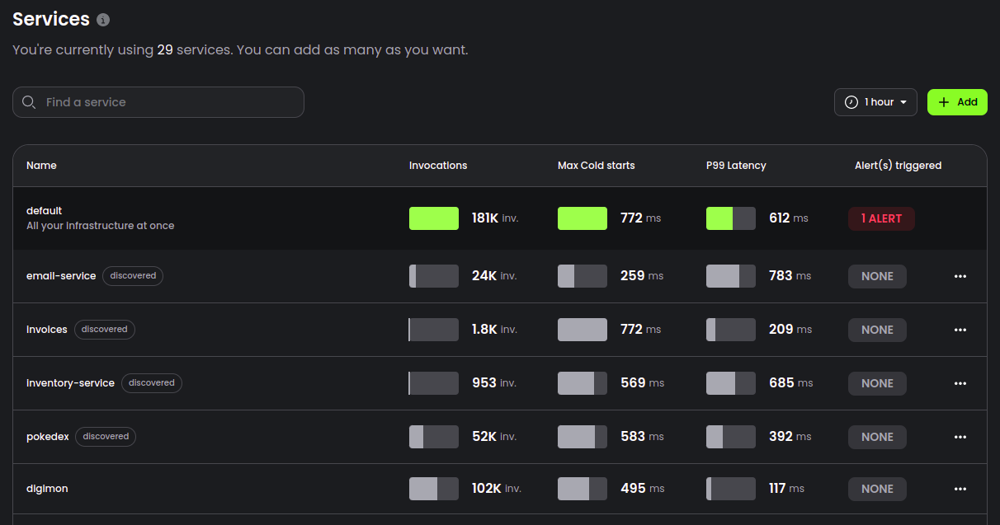

# Automatic Service Discovery

Baselime automatically discovers services in your cloud accounts, and organize logs, metrics, traces, and other telemetry data into services.

With automatic service discovery, Baselime organises your observability following services and teams boundaries, enabling you to quickly sift through the vast amounts of data your applications produce.

---

## Discovering Services

Baselime automatically discovers all cloud resources in your cloud accounts. Each resource is linked to a service. The service is typically based on the deployment framework that you use.

+++ AWS CDK

The service name is the name of the CloudFormation template the AWS CDK generates during `cdk synth`

+++ SST

The name of the service is the name of the SST app

+++ Serverless Framework

The name of the service is the name of the Serverless Framework App

+++ AWS SAM

The name of the service is the name of the CloudFormation template generated when deploying the AWS SAM application

+++ CloudFormation

The name of the service is the name of the CloudFormation template

+++

When ingesting data from your architecture, Baselime correlates the incoming data with the service name of the cloud resource the data originates from. For example, all the logs of an AWS Lambda function deployed with CloudFormation are correlated with the name of the CloudFormation stack.

You can then view a list of services in the [Baselime console](https://console.baselime.io), with key health.

Organising telemetry data by service enables you to query only the data for a specific service when exploring telemetry data. For cases where there's a defect that spans multiple services, Baselime enables you to run queries across all services through the `default` service.

---

## Overriding the service discovery

To force the resources from a CloudFormation stack to belong to a service with a different name, set the value of the tag `baselime:service` to the desired service name on the CloudFormation template. All resources deployed with the CloudFormation template will be correlated with the desired service name.