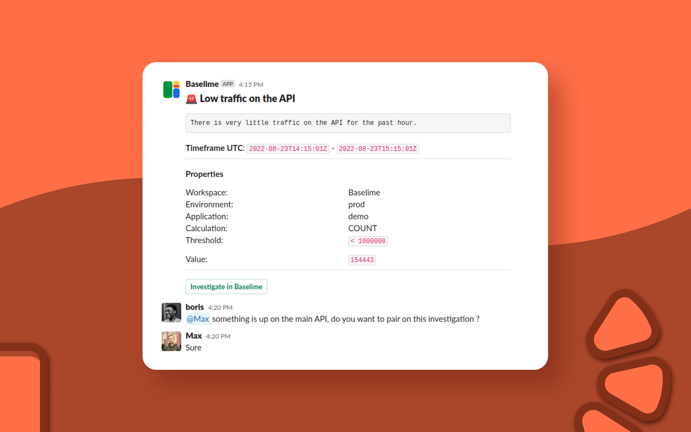

You can set one or multiple Slack channels to receive automated alerts.

```yaml # :icon-code: .baselime/demo.yml
# Channel ID
developers:
  type: channel
  properties:    
    type: slack    
    targets:
     - general
     - engineering
     - devs
```
Please make sure that the channels defined either are public, or you have manually added the Baselime Slack app to those.

Once configured, When an alert that is configured to send notifications to Slack is triggered, the Baselime Slack app will notify all the configured channels.

