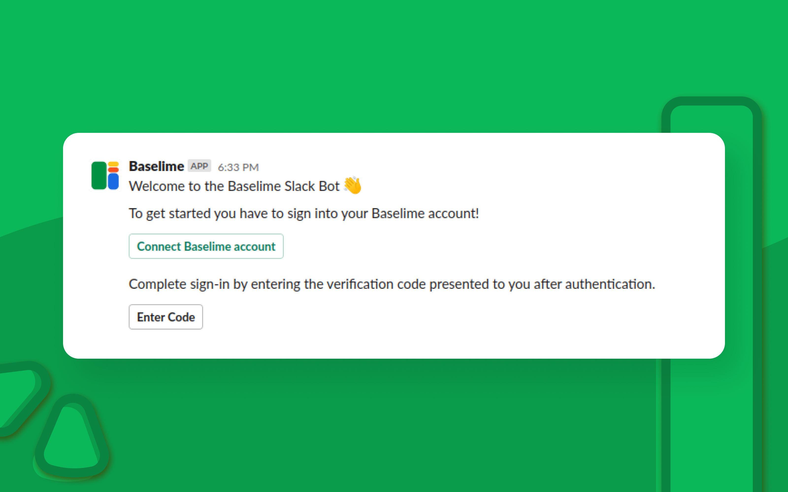
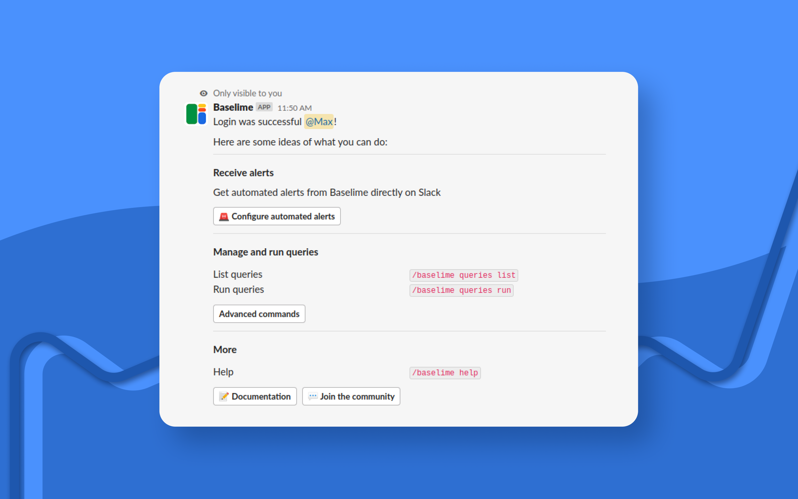

[Install the Baselime integration for Slack](https://slack.baselime.io/slack/install).

Once you install the app in your Slack workspace, you can start interacting with Baselime app as a Personal app or access from channels. By default, the Baselime app is enabled in all the public channels. For private channels, you need to explicitly invite /invite @baselime

At this point, your Slack and Baselime user accounts are not linked. You will be prompted to log in Baselime. This is a primary step required to access the app.

The primary button will redirect you to the Baselime console where you can login and connect your Slack.

Once this is completed, you will be greeted with a help message 🎉.

