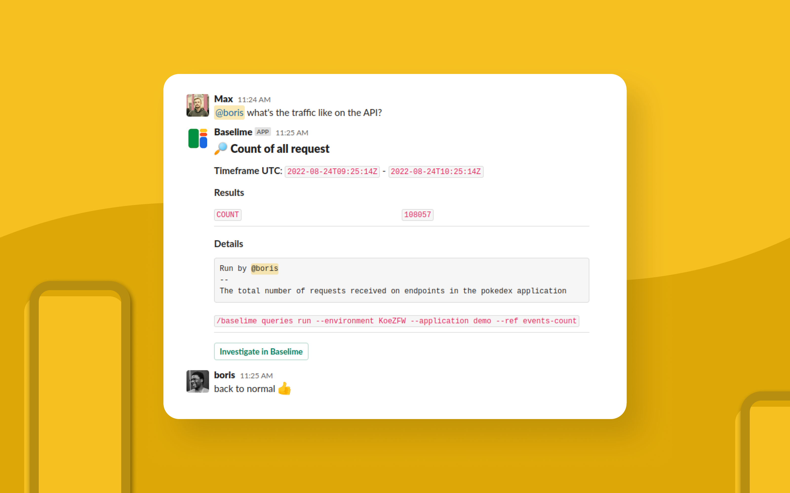

You can use the `/baselime` command to interact with Baselime straight from Slack.

---

## queries

### run

Run a query.

```bash # :icon-terminal: slack
/baselime queries run --environment <environment_id> --application <application_name> --ref <query_ref> --from 2days --to 1day
```

**Options**

- `--application`: Name of the application
- `--ref`: Query reference
- `--from`: UTC start time - may also be relative eg: 1h, 20mins
- `--to`: UTC end time - may also be relative eg: 1h, 20mins, now
- `--id`: Query id

**Result**



### list

[Coming Soon]

---

## help

Displays help.

```bash # :icon-terminal: slack
/baselime help
```
