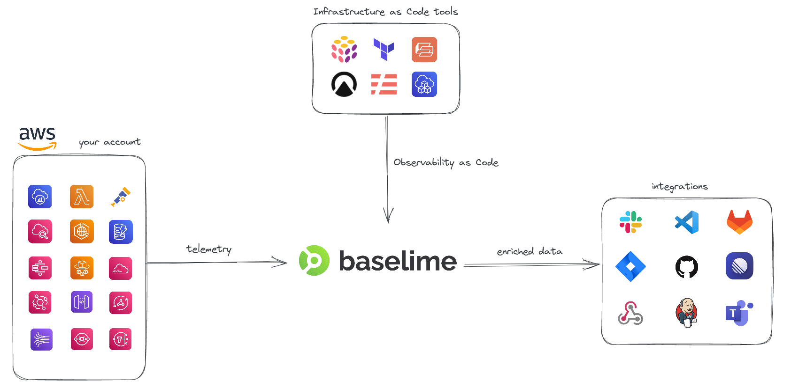

# Quickstart Guide

---


Welcome to Baselime! This quickstart guide will help you get up and running with the platform in just a few steps.


All you need is:
- An [AWS Account](https://aws.amazon.com/)
- Permissions to deploy a [CloudFormation](https://aws.amazon.com/cloudformation/) stack with IAM role.
- A deployed application leveraging [AWS Lambda](https://aws.amazon.com/lambda/) and other [AWS serverless services](https://aws.amazon.com/serverless/)

If you do not have a deployed application, you can use our [example pokedex](https://github.com/baselime/pokedex).



---

## Step 1: Sign up for Baselime

To use Baselime, you'll need to sign up for an account. You can sign up for a free account [here](https://console.baselime.io).

1. Create a workspace. Typically this will be the name of your organisation.
2. Start exploring the telemetry data in your workspace sandbox.

---

## Step 2: (Optional) Install the Baselime CLI

The Baselime CLI is a command-line tool that you can use to interact with the platform. Installing the CLI can make it easier to work with Baselime, unlocks Observability as Code and provides additional functionality not available in the web console. To install the CLI, follow the instructions [here](./cli/install.md).

---

## Step 3: Connect your AWS account

To start collecting telemetry data from your serverless application, you'll need to connect your AWS account to Baselime. This is done by deploying a CloudFormation template onto your AWS account.

To generate and download the CloudFormation template:

- Go to the [Baselime Console](https://console.baselime.io) or run the following command in the Baselime CLI:
```bash # :icon-terminal: terminal
baselime environments connect
```
- Follow the prompts to generate and download the template.

Next, you must deploy the template to your AWS account:

- Click the link provided by the Baselime Console or CLI to open the CloudFormation service in your AWS account
- Check the box to acknowledge that the template creates IAM roles
- Click "Create stack" to deploy the stack, making sure to use the correct credentials and region for your AWS account

We've open-sourced the CloudFormation template [here](./connectors/aws.md).

Once the stack is deployed, telemetry data from your AWS account will be automatically ingested by Baselime and will be available through the various clients.

To verify the connection, invoke any deployed AWS Lambda function in your account and you should see data from it in the Baselime console within seconds. Additionally, you can stream all the events ingested by Baselime directly in your terminal using the `baselime tail` command.

!!!warning
If you do not complete any of the above steps, Baselime will not be able to ingest data from your AWS account.
!!!

!!!warning
If you do not see any data in the Baselime UI or using the baselime tail command within seconds of completing the above steps, something went wrong. Please [contact us](mailto:support@baselime.io).
!!!

---

## Step 4: Explore the data

Once your AWS Account is connected, you can start exploring the telemetry data it generates. You can use the web console or the CLI (if installed) to access and analyze the data.

Baselime ingests and indexes every field and nested field in your telemetry data. 

### Accessing data in the web console


To explore the data in the web console:

- Go to the [Baselime Console](https://console.baselime.io) and sign in with your account
- Select your environment from the list of environments
- Use the various filters and tools in the console to slice and dice the data, such as:
  - Filtering by resource type, key-value pair, operation type, or time range
  - Searching for specific strings or regexes in the data
  - Viewing the trace data for a specific request or operation
  - Viewing the logs and metrics for a specific resource or operation
  - Segmenting the results by specific field or nested field

### Accessing data in the CLI

To access the data in the CLI:

If you installed the CLI, you can use the `baselime query` command to interactively explore the data. Here's how it works:
1. If you haven't already done so, sign in to the CLI using the `baselime login` command
2. Run the following command:

```bash # :icon-terminal: terminal
baselime query
```

3. Select the service you want to query
4. Select one of your saved queries or interactively build a query
5. Enter the start and end time for the query (optional - defaults to the past hour)
6. The command will output a table with the results of the query and a unique URL that you can share with your team

```txt # :icon-code: output
✔ Running the query
╔════════════════╤════════════════════╗
║ Aggregate      │ Value              ║
╟────────────────┼────────────────────╢
║ MAX(@duration) │ 8758.75            ║
╟────────────────┼────────────────────╢
║ MIN(@duration) │ 2.25               ║
╟────────────────┼────────────────────╢
║ P99(@duration) │ 322.98440000000005 ║
╚════════════════╧════════════════════╝

Follow this url: https://console.baselime.io/<workspace>/<env>/queries/lambda-duration/1653302639712
```
---

## Guides

- [Sending Data](./sending-data/overview.md): Learn how to ingest telemetry data from your serverless applications
- [Analyzing Data](./analysing-data/service-discovery.md): Discover how to use the various interfaces provided by Baselime to analyze and understand your data
- [Integrations](./): Find out how to connect Baselime with your favorite tools


---
## Reference

- [Baselime CDK Reference Guide](./oac/cdk/quick-start.md): Learn about how to use Baselime with the AWS CDK to define your Observability as Code
- [ORL Reference Guide](./oac/observability-reference-language/overview.md): Learn about the Baselime Observability Reference Language (ORL) and how to use it to define observability configurations
- [CLI Reference](./cli/install.md): Complete reference for the Baselime command-line interface

---
## Community

Join the Baselime community to get help with using the platform, share your own experiences, and stay up-to-date with the latest developments.

- [Slack](https://join.slack.com/t/baselimecommunity/shared_invite/zt-1eu7l0ag1-wxYXQV6Fr_aiB3ZPm3LhDQ): Join our Slack community to connect with other Baselime users and get real-time support from the Baselime team
- [Blog](https://baselime.io/blog): Read about the latest features, best practices, and more from the Baselime team
- Social media: Follow us on [Twitter](https://twitter.com/baselimeHQ), [LinkedIn](https://www.linkedin.com/company/baselime), and [YouTube](https://youtube.com/@baselimedev) to stay up-to-date with the latest news and updates from Baselime

We look forward to connecting with you!