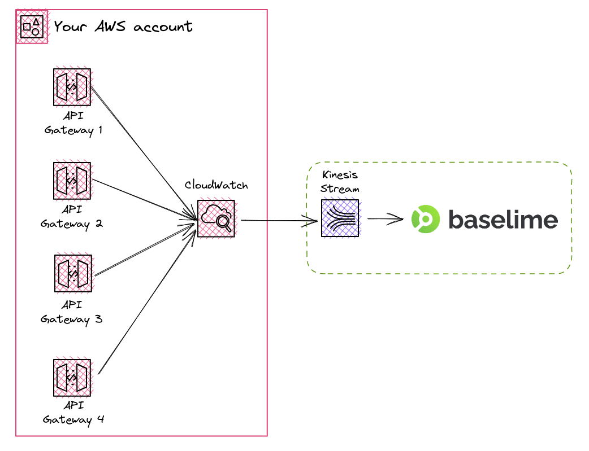

# Amazon API Gateway Logs

Once you connect your AWS account to Baselime, Baselime automatically create
[CloudWatch Logs subscription filters](https://docs.aws.amazon.com/AmazonCloudWatch/latest/logs/SubscriptionFilters.html)
to automatically ingest logs from your Amazon API Gateways.

---

## Setup

Baselime can ingest logs only for API Gateways where access logs are
appropriately configured.

We recommend this configuration for API Gateway logs:

```json #
{
  "requestTime":"$context.requestTime",
  "requestId":"$context.requestId",
  "httpMethod":"$context.httpMethod",
  "path":"$context.path",
  "resourcePath":"$context.resourcePath",
  "status":"$context.status",
  "responseLatency":"$context.responseLatency",
  "xrayTraceId":"$context.xrayTraceId",
  "integrationRequestId":"$context.integration.requestId",
  "functionResponseStatus":"$context.integration.status",
  "integrationLatency":"$context.integration.latency",
  "integrationServiceStatus":"$context.integration.integrationStatus",
  "ip":"$context.identity.sourceIp",
  "userAgent":"$context.identity.userAgent",
  "principalId":"$context.authorizer.principalId"
}
```

It is possible to enable API Gateway access logs from your favourite Infrastructure as Code tool, using the CLI or in the AWS console. Below is an example of how to enable API Gateway logs using the serverless framework.

```yaml #
# serverless.yml
service: my-service

provider:
  name: aws
  runtime: nodejs16.x
  logs:
    restApi:
      accessLogging: true
      format: '{"requestTime":"$context.requestTime","requestId":"$context.requestId","httpMethod":"$context.httpMethod","path":"$context.path","resourcePath":"$context.resourcePath","status":$context.status,"responseLatency":$context.responseLatency,"xrayTraceId":"$context.xrayTraceId","integrationRequestId":"$context.integration.requestId","functionResponseStatus":"$context.integration.status","integrationLatency":"$context.integration.latency","integrationServiceStatus":"$context.integration.integrationStatus","ip":"$context.identity.sourceIp","userAgent":"$context.identity.userAgent","principalId":"$context.authorizer.principalId"}'
```
---

## How it works

The following diagram illustrates the process for sending Amazon API Gateway logs to Baselime. Once Baselime is connected to an AWS Account, it automatically creates Logs subscription filters for all the API Gateways in the account.



Moreover, Baselime automatically creates new subscription filters for newly deployed API Gateways, thanks to it CloudTrail integration. Baselime listens to new API Gateway events in CloudTrail and appropriately creates subscription filters for newly created API Gateways functions. 


