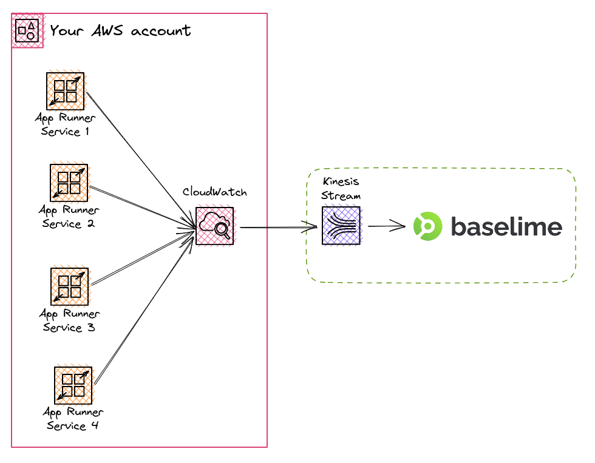

# AWS App Runner Logs

Once you connect your AWS account to Baselime, Baselime automatically create
[CloudWatch Logs subscription filters](https://docs.aws.amazon.com/AmazonCloudWatch/latest/logs/SubscriptionFilters.html)
to automatically ingest logs from your AWS App Runner logs.

---

## How it works

Once Baselime is connected to your AWS Account, it automatically creates Logs subscription filters for all the AWS App Runner services in the account. AWS App Runner automatically creates two log groups for each service:
- `/aws/apprunner/<service-name>/<unique-id>/application`: the logs from the container running
- `/aws/apprunner/<service-name>/<unique-id>/service`: the internal logs of the AWS App Runner service, typically deployment logs

Baselime create subscription filters for the log groups ending in `/application`: the logs from the container.

Moreover, Baselime automatically creates new subscription filters for newly deployed AWS App Runner services. Baselime listens to new App Runner events in Amazon CloudTrail and creates subscription filters for newly created AWS App Runner services. 

---

## Troubleshooting

If you're having trouble sending data from your AWS App Runner logs to Baselime, here are a few things to check:

- Verify that your AWS account is correctly connected to Baselime and you receive data in other datasets such as [CloudWatch Metrics](./cloudwatch-metrics.md) or [CloudTrail Events](./cloudtrail.md)
- Check that your App Runner services functions are not already using the maximum number of subscription filters allowed per log group. AWS limits each log group to 2 subscription filters at most. If you're already at the limit, you can remove subscription filters with the [cloudwatch-subscription-filters-remover](https://github.com/baselime/cloudwatch-subscription-filters-remover) to delete the ones you don't need anymore.
- Make sure that your AWS App Runner services are being live and you can view the logs in the CloudWatch section of the AWS Console.

