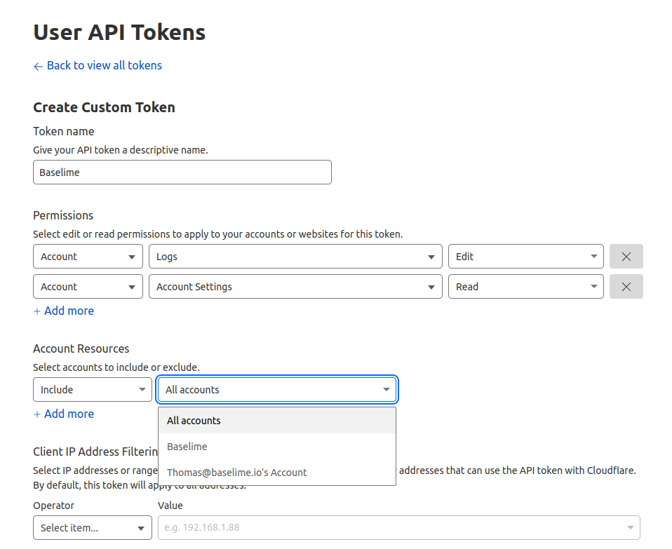

# Baselime Cloudflare Integration

Baselime offers advanced monitoring capabilities for applications running on Cloudflare workers. This guide will help you connect your Cloudflare account to Baselime, enabling you to monitor your Cloudflare workers effectively.

## 1. Create an API Token

To get started, you need to create an API token for your Cloudflare account. This token will allow Baselime to access the necessary data. Follow these steps:

**Step 1:** Go to the Cloudflare Dashboard API Tokens page by clicking [here](https://dash.cloudflare.com/profile/api-tokens).

**Step 2:** Create a user API token with the following permissions:

- **Logs - Edit:** This permission is required to set up logpush configurations to collect logs from Cloudflare.
- **Account Settings - Read:** This permission is needed to list the accounts and add them to Baselime automatically.

Make sure to grant access to each Cloudflare account you want to connect to Baselime. Here's an image to help you find this option in the Cloudflare Dashboard:

## 2. Add Your Cloudflare Account to Baselime

Once you have your API token, follow these steps to connect your Cloudflare account to Baselime:

**Step 1:** In the Baselime platform, select "Connect Cloudflare Account."

**Step 2:** Add the API token you created in the previous step and connect your Cloudflare account.

## 3. Enable Logpush on Your Cloudflare Workers

To complete the setup, you'll need to enable logpush on your Cloudflare workers. Follow the Cloudflare documentation to learn how to do this:

**Step 1:** Check out the [Cloudflare documentation](https://developers.cloudflare.com/workers/observability/logpush/#enable-logging-on-your-worker) on enabling logpush for your Cloudflare workers.

By following these steps, you'll successfully connect your Cloudflare account to Baselime and enable the necessary logging for monitoring your Cloudflare workers effectively.