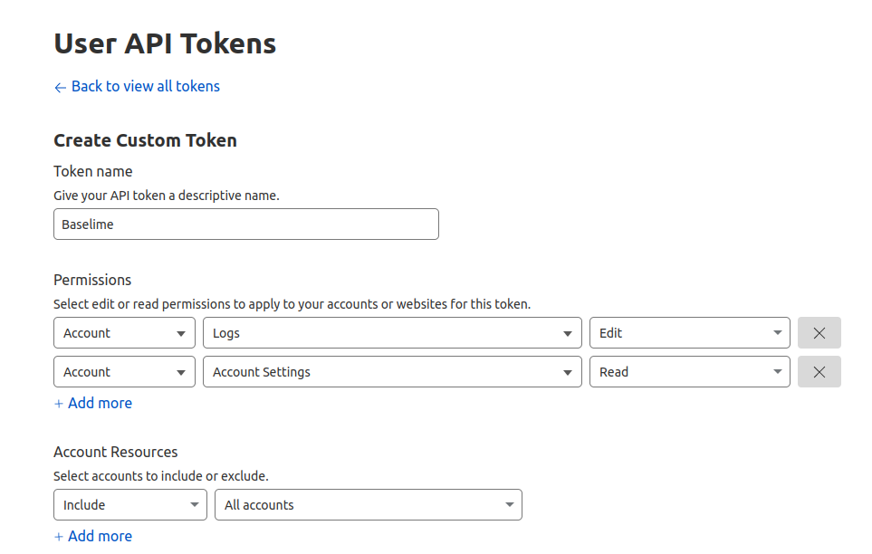
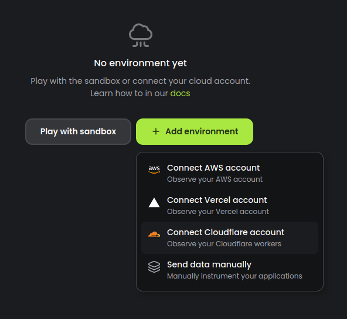
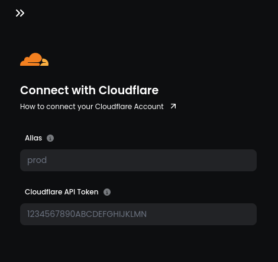

# Using Cloudflare Logpush

[Cloudflare Logpush](https://developers.cloudflare.com/logs/about/) is a service provided by Cloudflare that enables you to stream your Cloudflare Worker Trace Event Logs to Baselime.

!!!
Cloudflare Logpush is available only to accounts subscribed to the Cloudflare Workers Paid Plan
!!!

!!!
Cloudflare Logpush is not available for Cloudflare Pages. For Cloudflare pages, please refer to the [Baselime Edge Logger](./edge-logger.md) section.
!!!

---

## Usage

Baselime connects to your Cloudflare account and enables Logpush in a few steps:

### 1. Create an API Token

To get started, you need to create an API token for your Cloudflare account. This token will enable Baselime to access create the Logpush and add metadata to your events once they are ingested into Baselime.

[Create a user API token](https://dash.cloudflare.com/profile/api-tokens?permissionGroupKeys=[{"key":"account_logs","type":"edit"},{"key":"account_settings","type":"read"}, {"key":"workers_scripts","type":"read"}]&name=Baselime) with the following permissions from the Cloudflare Dashboard:


- **Logs - Edit:** This permission is required to set up logpush configurations to collect logs from Cloudflare.
- **Account Settings - Read:** This permission is needed to list the accounts and add them to Baselime automatically.
- **Worker Scripts - Read:** This permission is needed to list the Workers and add them to your Baselime Services.

Select all the Cloudflare accounts you want to observe in Baselime.


!!!
Learn more about API tokens in the [Cloudflare Docs](https://developers.cloudflare.com/fundamentals/api/get-started/create-token/)
!!!


### 2. Connect Your Cloudflare Account to Baselime

Use the API Token you created in the previous step to connect your Cloudflare account to Baselime in the [Baselime console](https://console.baselime.io).

**Step 1:** Create a new environment



**Step 2:** Add the API token you created in the previous step and connect your Cloudflare account.



### 3. Enable Logpush on Your Cloudflare Workers

To complete the setup, it's necessary to enable Logpush on your Cloudflare workers.

Add `logpush = true` to the top level section of your Workers `wrangler.toml` file

```toml # :icon-code: wrangler.toml
# Top-level configuration

name = "my-worker"
main = "src/index.js"
compatibility_date = "2022-07-12"

workers_dev = false
logpush = true
route = { pattern = "example.org/*", zone_name = "example.org" }
```

!!!
Learn more about [enabling Logpush on your Cloudflare workers](https://developers.cloudflare.com/workers/observability/logpush/#enable-logging-on-your-worker).
!!!

### 4. Using the Cloudflare Workers Logpush integration

Once you've connected your Cloudflare account to Baselime, all your Workers Trace Events will be available in Baselime. You can search, query or tail your logs from the console and the CLI. You can create alerts from derived metrics from your logs. You can use our dashboard templates to create dashboards based on your Cloudflare events, and modify them at will.
