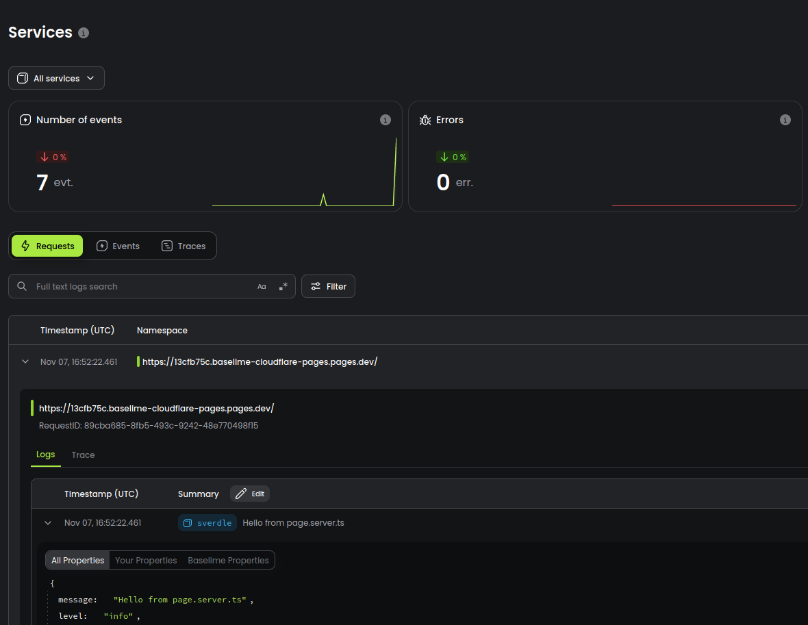

You can setup logs for [SvelteKit](https://kit.svelte.dev/) on [Cloudflare Pages](https://developers.cloudflare.com/pages/) Functions in 5 steps.

---
**Step 1:** Install the [@baselime/edge-logger](https://github.com/baselime/edge-logger) package.

```bash # :icon-terminal: terminal
npm i @baselime/edge-logger
```
---
**Step 2:**

Update your projects package json with the these `build` and `deploy` scripts

```json #5-6 :icon-code: package.json
{
  "name": "my-svelte-app",
  "scripts": {
    ...
  	"build": "CF_PAGES=1 vite build",
    "deploy": "npm run build && wrangler pages deploy .svelte-kit/cloudflare",
    ...
  },
  ...
}    
```
---
**Step 3:**


Add the logger to your sveles `hook.server.js` file

```javascript #4-8,12 :icon-code: src/hook.server.js
import { BaselimeLogger } from "@baselime/edge-logger";


export const handle = async ({ event, resolve }: { event: any, resolve: any}) => {

    const baselimeApiKey = String(event.platform?.env?.BASELIME_API_KEY);

    const context = event.platform?.context || { waitUntil: () => {}, passThroughOnException: () => {} }
    const logger = new BaselimeLogger({
        service: 'sverdle',
        namespace: event.request.url,
        apiKey: baselimeApiKey,
        isLocalDev: event.platform ? false : true,
        ctx: context
    });
    
    event.logger = logger
  
    const result = await resolve(event);

    context.waitUntil(logger.flush());
    return result
};
```

You can access the logger in all your [SvelteKit](https://kit.svelte.dev/) server side code

```javascript #5 :icon-code: src/routes/page.server.ts
import type { BaselimeLogger } from '@baselime/edge-logger';

export async function load({ logger }) {
   
    logger.info("Hello from page.server.ts")

    return {
        data: Math.random(),
        message: "hello"
    };
}
```

---

**Step 4:**

Deploy the worker to Cloudflare pages using the npm command `npm run deploy`.

To enable logging add the `BASELIME_API_KEY` environment variable to your cloudflare worker project in the [console](https://dash.cloudflare.com).


---

**Step 5:**

View your logs in the [Baselime Console](https://console.baselime.io).

