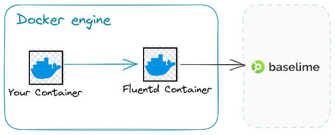

# Docker Logs
Docker allows you to configure a [logging driver](https://docs.docker.com/config/containers/logging/configure/) for each container.
By using Fluentd as your logging driver you'll be able to stream your logs to Baselime over
HTTPS.

---

## What is Fluentd?
[Fluentd](https://www.fluentd.org/) is an open source data collector for unified logging layer that is widely used
by companies such as AWS, Google, Microsoft, and more.

---
## How to use Fluentd with Baselime?

First obtain the API key from the
[Baselime console](https://console.baselime.io).


Next, create the following configuration file for Fluentd.

```apacheconf # :icon-code: fluent.conf
# fluentd/conf/fluent.conf
<match>
  @type http
  endpoint https://events.baselime.io/v1/docker-logs
  headers {"x-api-key":"YOUR_API_KEY"}
  open_timeout 2
  json_array true
  <format>
    @type json
  </format>
</match>
```
!!! Note
Make sure to replace `YOUR_API_KEY` with the API key you obtained from the Baselime console.
!!!

Now you need to start the Fluentd container and mount the configuration file you created.
```shell
$ docker run \
    -d \
    -v ./conf:/fluentd/etc \
    -p 24224:24224 \
    fluentd:latest
```

Next, you need to configure your Docker container to use Fluentd as the logging driver.
```shell
$ docker run -d \
    --log-driver=fluentd \
    --log-opt fluentd-address=localhost:24224 \
    --log-opt labels=io.baselime.service,io.baselime.namespace \
    --labels io.baselime.service=service_name \
    --labels io.baselime.namespace=namespace_name \
    YOUR_IMAGE
```

Pay attention to the `labels` options. It is used to extract the `service` and `namespace` fields.

---
## Using Docker Compose
If manage your containers with Docker Compose, you can use the following configuration YAML.

```yaml # :icon-code: docker-compose.yaml
version: "3.7"
services:
  your_service:
    image: YOUR_IMAGE
    depends_on:
      - fluentd
    logging:
      driver: fluentd
      options:
        fluentd-address: localhost:24224
        labels: "io.baselime.service,io.baselime.namespace"
  fluentd:
    image: fluentd:latest
    volumes:
      - ./conf:/fluentd/etc
    environment:
      - FLUENTD_CONF=fluent.conf
    labels:
      io.baselime.service: "my-service"
      io.baselime.namespace: "my-namespace"
```

## Best practices

We expect the log messages to be in JSON format. For example:
```json
{
  "message": "Hello world!",
  "timestamp": 1697109850
}
```

or 

```json
{
  "message": "Hello world!",
  "timestamp": "2023-10-13 08:46:00 +0000"
}
```

### Docker Labels
Make sure to set these labels on your Docker containers:
* `io.baselime.service` - used to extract service name used in Baselime console.
* `io.baselime.namespace` - used to extract the namespace used in Baselime console.


---
## How it works


By defining logging driver as Fluentd and providing docker with the Fluentd address,
the Docker will send your logs over TCP to Fluentd. In the above example, we've provided
as `localhost:24224` as the Fluentd address. This value needs to be adjusted
accordingly to your environment and network configuration.

Using provided Fluentd configuration, Fluentd will match the incoming logs and send them
to Baselime over HTTPS. The API Key is used to authenticate the request and route 
the logs to your workspace and environment.


