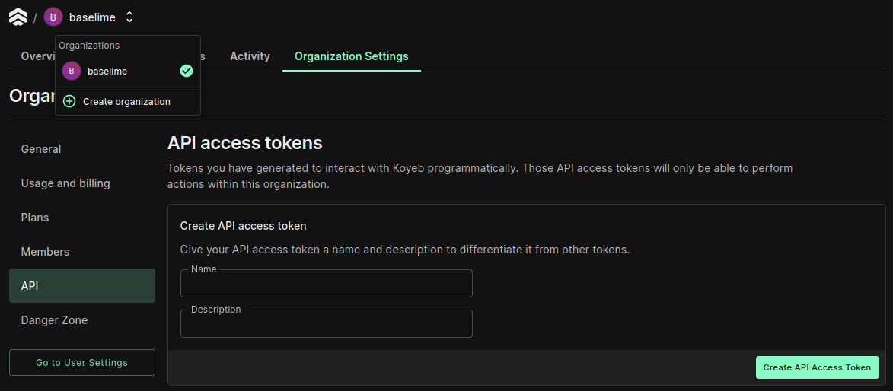
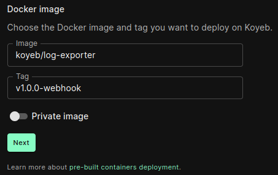
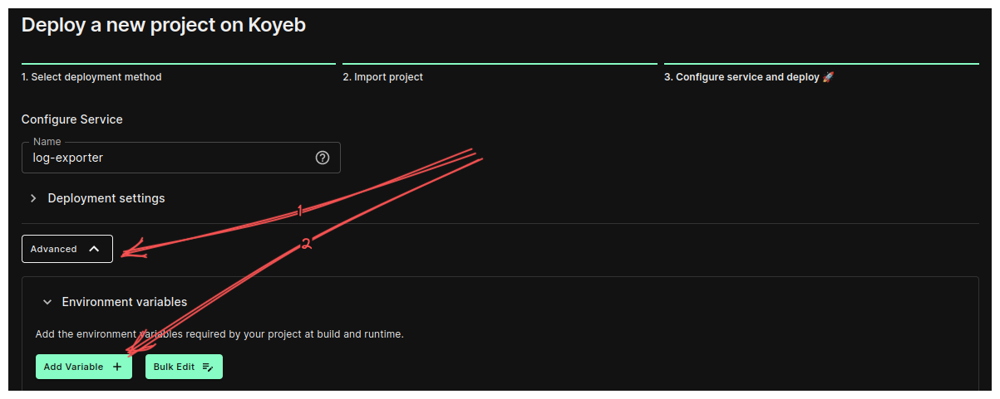
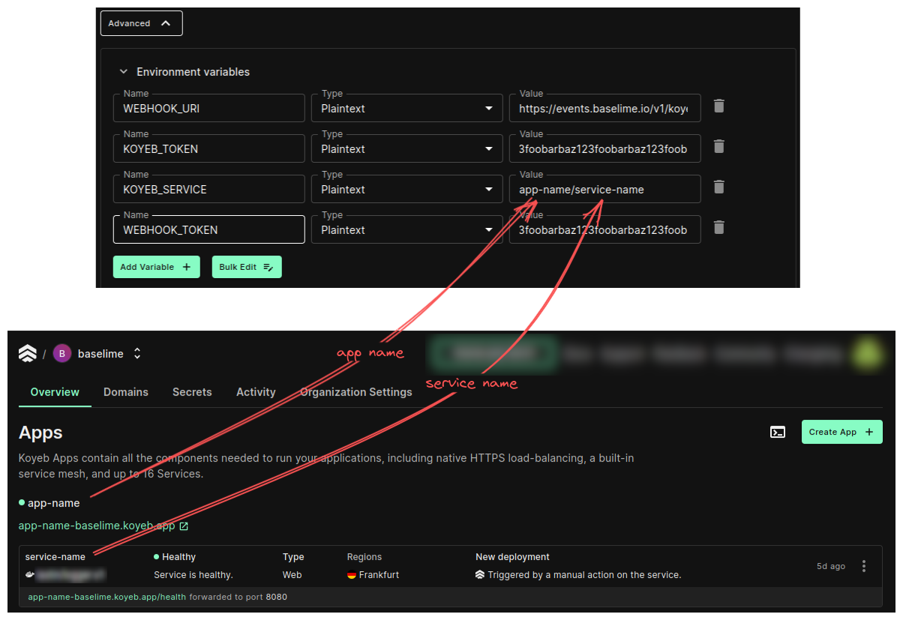

# Koyeb Logs
Koyeb is a serverless platform that allows you to run applications without having to manage servers and infrastructure.
You can stream your Koyeb services logs using their log exporter.

## Generating Koyeb API Key
This key is necessary for Koyeb logger to have access to your services.
Follow these steps to generate an API key:
1. Select the organisation you want to add logging to.
2. Navigate to "Organization Settings"
3. Select "API" from left-hand menu
4. Create new API key and copy it for later

## Creating Logger service
In our example we have set up an app called **app-name** and within that app
we've created a service called **service-name**. We want to observe logs from
that service in Baselime console. In order to do that we now need to create a 
logger service which will be responsible for sending logs to Baselime.

To do that follow these steps:
1. Navigate to "Overview" tab in your organisation
2. Click "Create App+" button
3. Select "Docker"
4. As "Image" enter `koyeb/log-exporter` and as "Tag" enter `v1.0.0-webhook`

5. On the next page click button "Advanced" and then "Environment Variables"

6. Add the following environment variables:

Variable Name | Variable Value
---           | ---
`WEBHOOK_URI`   | `https://events.baselime.io/v1/koyeb`
`WEBHOOK_TOKEN` | `your-baselime-api-key`
`KOYEB_TOKEN`   | `your-koyeb-token`
`KOYEB_SERVICE` | `app-name/service-name`
!!!
* `WEBHOOK_URI` should be set to `https://events.baselime.io/v1/koyeb`, but you can replace `koyeb` part of path with dataset name you desire.
* Replace `your-baselime-api-key` with the API key you obtained from the Baselime console.
* Replace `your-koyeb-token` with the API key you obtained from the Koyeb console.
* Replace `app-name/service-name` with the name of your service.
!!!

8. Click "Deploy" button at the bottom of the page.

Once deployed you should now start seeing the logs from your Koyeb service in the Baselime console.