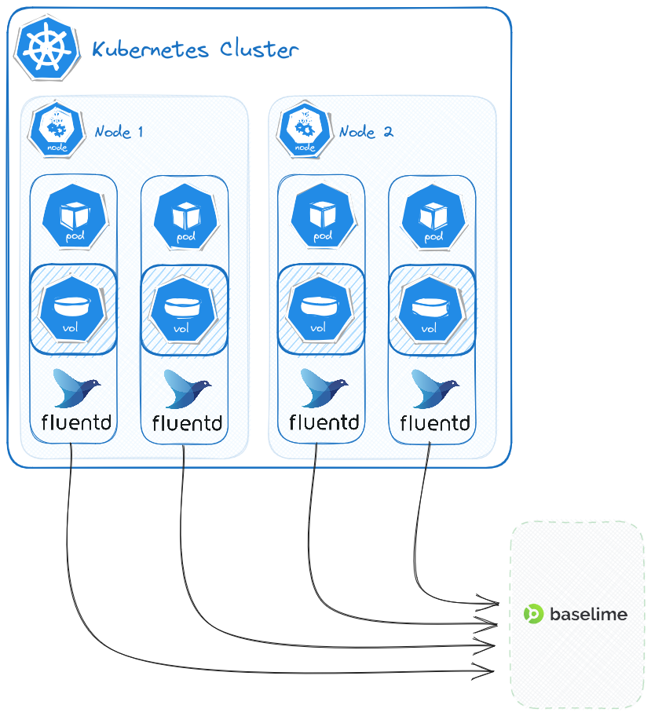

# Kubernetes Logs
If you use Docker as your container runtime, you can stream your container logs
to Baselime by using Fluentd as your logging driver

---
## What is Fluentd?
[Fluentd](https://www.fluentd.org/) is an open source data collector for unified logging layer that is widely used
by companies such as AWS, Google, Microsoft, and more.

---
## How to configure Fluentd to stream Kubernetes logs to Baselime?
The setup is very similar to the [Docker setup](https://baselime.io/docs/sending-data/docker/)

First obtain the API key from the
[Baselime console](https://console.baselime.io).

Next, create a ConfigMap that will contain the Fluentd configuration.
```yaml # :icon-code: config.yaml
apiVersion: v1
kind: ConfigMap
metadata:
  name: fluentd-config
data:
  fluent.conf: |
    <source>
      @type tail
      path /var/log/containers/*.log, /var/log/pods/*.log
      exclude_path ["/var/log/containers/fluentd-*.log"]
      pos_file /var/log/fluentd-containers.log.pos
      tag container_logs
      <parse>
        @type regexp
        expression /^(?<log>.*)$/
      </parse>
    </source>
    <match>
      @type http
      endpoint https://events.baselime.io/v1/kubernetes-logs
      headers {"x-api-key":"YOUR_API_KEY"}
      open_timeout 2
      <format>
        @type json
      </format>
    </match>
```
!!! Note
Make sure to replace `YOUR_API_KEY` with the API key you obtained from the Baselime console.
!!!

Next, we need to create a DaemonSet that will run Fluentd on each node in your cluster.
```yaml # :icon-code: daemonset.yaml
apiVersion: apps/v1
kind: DaemonSet
metadata:
  name: fluentd
  labels:
    k8s-app: fluentd-logging
    version: v1
spec:
  selector:
    matchLabels:
      k8s-app: fluentd-logging
      version: v1
  template:
    metadata:
      labels:
        k8s-app: fluentd-logging
        version: v1
    spec:
      containers:
        - name: logger
          image: fluent/fluentd-kubernetes-daemonset:v1.11.5-debian-elasticsearch7-1.1
          env:
            - name: FLUENTD_ARGS
              value: -c /fluentd/etc/fluent.conf
          volumeMounts:
            - mountPath: /fluentd/etc
              name: config-volume
            - name: varlog
              mountPath: /var/log
            - name: dockercontainerlogdirectory
              mountPath: /var/lib/docker/containers
              readOnly: true
      volumes:
        - name: varlog
          hostPath:
            path: /var/log
        - name: config-volume
          configMap:
            name: fluentd-config
            items:
              - key: fluent.conf
                path: fluent.conf
        - name: dockercontainerlogdirectory
          hostPath:
            path: /var/lib/docker/containers
```


---
## Best practices
We expect the log messages to be in JSON format. For example:
```json
{
  "message": "This is a message from ",
  "timestamp": 1697109850,
  "service": "my-service",
  "namespace": "my-namespace"
}
```

### Required fields
- `message` - The log message
- `timestamp` - The timestamp of the log message in seconds since epoch (Unix time) or ISO 8601 format  
- `service` - The name of the service that generated the log message
- `namespace` - The namespace of the service that generated the log message

---
## How it works


DaemonSet provided above creates an instance of FluentD pod on each node in your cluster.
The FluentD pod reads the logs from the `/var/log/containers/*.log` and `/var/log/pods/*.log` directories
and sends them to Baselime over HTTPS.

You can find example implementation in our [GitHub repository](https://github.com/baselime/examples/tree/main/kubernetes-logs)