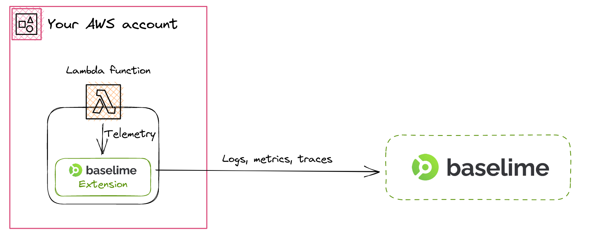

# Lambda Telemetry Extension

Instrumenting AWS Lambda functions with Baselime is straightforward using our
Lambda Extension. The Lambda Extension listens to invocation events and collects
telemetry data, such as logs and runtime metrics. Once collected, the telemetry
data is sent to Baselime for storage, analysis, and visualization. In this
section, we'll walk you through the process of instrumenting your Lambda
functions with the Baselime Lambda Extension.

Before getting started you'll need to make sure that you have your Baselime API
key ready. You can get it by running the following command using the Baselime
CLI.

```bash # :icon-terminal: terminal
baselime iam
```

---

## How it works

The Baselime Lambda Extension is language agonistic and is compressed as a
single binary, such that it minimises its impact cold-starts and performance.

The diagram below illustrates how the Baselime Lambda Extension works within
your architecture.



All the telemetry data from your Lambda function is collected asynchronously
from your invocation, and sent to the Baselime backend in a separate process
from your invocation.

---

## Instrumenting

To instrument your AWS Lambda Functions with the Baselime Lambda Extension, we
recommend using your Infrastructure as Code tool of choice, and add the
Extension as a Lambda Layer.

It is necessary to add the Baselime API key to the extension as an environment
variable. The example below shows the process with the serverless framework.

```yaml #
# serverless.yml
service: myService
 
provider:
  name: aws
  runtime: python3.8
  environment:
    BASELIME_KEY: <BASELIME_KEY>
  layers:
    - <BASELIME_LAMBDA_LAYER_ARN>
 
functions:
  hello:
    handler: handler.hello
```

Where the `BASELIME_KEY` is your Baselime API Key and the
`BASELIME_LAMBDA_LAYER_ARN` is the ARN of the Baselime Layer in your region. The
table below outlines the list of Baselime Layer ARNs for every supported region.

| Region         | Architecture | ARN                                                                                    |
| -------------- | ------------ | -------------------------------------------------------------------------------------- |
| us-east-1      | x86-64       | arn:aws:lambda:us-east-1:097948374213:layer:baselime-telemetry-extension-x86_64:3      |
| us-east-1      | arm64        | arn:aws:lambda:us-east-1:097948374213:layer:baselime-telemetry-extension-arm64:3       |
| us-east-2      | x86-64       | arn:aws:lambda:us-east-2:097948374213:layer:baselime-telemetry-extension-x86_64:3      |
| us-east-2      | arm64        | arn:aws:lambda:us-east-2:097948374213:layer:baselime-telemetry-extension-arm64:3       |
| us-west-2      | x86-64       | arn:aws:lambda:us-west-2:097948374213:layer:baselime-telemetry-extension-x86_64:3      |
| us-west-2      | arm64        | arn:aws:lambda:us-west-2:097948374213:layer:baselime-telemetry-extension-arm64:3       |
| us-central-1   | x86-64       | arn:aws:lambda:us-central-1:097948374213:layer:baselime-telemetry-extension-x86_64:3   |
| us-central-1   | arm64        | arn:aws:lambda:us-central-1:097948374213:layer:baselime-telemetry-extension-arm64:3    |
| eu-west-1      | x86-64       | arn:aws:lambda:eu-west-1:097948374213:layer:baselime-telemetry-extension-x86_64:3      |
| eu-west-1      | arm64        | arn:aws:lambda:eu-west-1:097948374213:layer:baselime-telemetry-extension-arm64:3       |
| eu-west-2      | x86-64       | arn:aws:lambda:eu-west-2:097948374213:layer:baselime-telemetry-extension-x86_64:3      |
| eu-west-2      | arm64        | arn:aws:lambda:eu-west-2:097948374213:layer:baselime-telemetry-extension-arm64:3       |
| ap-south-1     | x86-64       | arn:aws:lambda:ap-south-1:097948374213:layer:baselime-telemetry-extension-x86_64:3     |
| ap-south-1     | arm64        | arn:aws:lambda:ap-south-1:097948374213:layer:baselime-telemetry-extension-arm64:3      |
| ap-southeast-1 | x86-64       | arn:aws:lambda:ap-southeast-1:097948374213:layer:baselime-telemetry-extension-x86_64:3 |
| ap-southeast-1 | arm64        | arn:aws:lambda:ap-southeast-1:097948374213:layer:baselime-telemetry-extension-arm64:3  |
| ap-southeast-2 | x86-64       | arn:aws:lambda:ap-southeast-2:097948374213:layer:baselime-telemetry-extension-x86_64:3 |
| ap-southeast-2 | arm64        | arn:aws:lambda:ap-southeast-2:097948374213:layer:baselime-telemetry-extension-arm64:3  |
| ap-northeast-1 | x86-64       | arn:aws:lambda:ap-northeast-1:097948374213:layer:baselime-telemetry-extension-x86_64:3 |
| ap-northeast-1 | arm64        | arn:aws:lambda:ap-northeast-1:097948374213:layer:baselime-telemetry-extension-arm64:3  |
| ca-central-1   | x86-64       | arn:aws:lambda:ca-central-1:097948374213:layer:baselime-telemetry-extension-x86_64:3   |
| ca-central-1   | arm64        | arn:aws:lambda:ca-central-1:097948374213:layer:baselime-telemetry-extension-arm64:3    |
