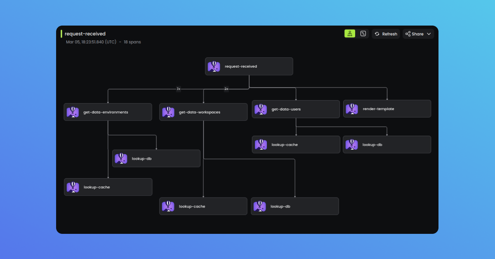

# OpenTelemetry for Go

The [Baselime Go OpenTelemetry SDK](https://github.com/baselime/go-opentelemetry) enables you to instrument your Go services with OpenTelemetry without the boilerplate of using the OpenTelemetry SDK directly.

This SDK uses [OpenTelemetry for Go](https://opentelemetry.io/docs/instrumentation/go/) and provides a layer that facilitates instrumenting your Go applications.

---

## Instrumentation
!!!info
Is your application already instrumented with [OpenTelemetry](https://opentelemetry.io/)?

[!ref icon="../../assets/images/logos/logo_open_telemetry.png" text="Configure endpoint and headers"](../platforms/opentelemetry/opentelemetry.md#configuration)
!!!

### Step 1: Install the SDKs

Install the [Baselime Go OpenTelemetry SDK](https://github.com/baselime/go-opentelemetry). 

```bash # :icon-terminal: terminal
go get github.com/baselime/go-opentelemetry
```

### Step 2: Add the OpenTelemetry Instrumentation to your application

```go # :icon-code: main.go
package main

import (
	"context"
	baselime_opentelemetry "github.com/baselime/go-opentelemetry"
	"go.opentelemetry.io/otel"
	"go.opentelemetry.io/otel/attribute"
	otelMetric "go.opentelemetry.io/otel/metric"
	"log"
	"net/http"
	"os"
)

// Example tracer and counter
var tracer = otel.Tracer("flyio_tracer")
var reqCounter, _ = otel.Meter("your_service_name").Int64Counter("http.request")

func main() {
	// Initialise Baselime OTEL distro
	params := baselime_opentelemetry.Config{}
	otelShutdown, err := baselime_opentelemetry.ConfigureOpenTelemetry(params)
	if err != nil {
		log.Fatalf("error setting up OTel SDK - %e", err)
	}
	defer otelShutdown()

	http.HandleFunc("/", func(w http.ResponseWriter, r *http.Request) {
		// Create new span for each request
		ctx, span := tracer.Start(r.Context(), "request-received")
		defer span.End()
		
		// Increment counter on each request, with path as an attribute
		reqCounter.Add(r.Context(), 1, otelMetric.WithAttributes(
			attribute.String("path", r.URL.Path),
		))
		
		// Step into function and produce nested span
		someCustomFunction(ctx)
	})
	log.Fatal(http.ListenAndServe(":"+port, nil))
}

// A function that produces its own span
func someCustomFunction(ctx context.Context) {
	ctx, span := tracer.Start(ctx, "get-data-environments")
	defer span.End()
}
```

### Step 3: Run your application
Now your Go application is instrumented with OpenTelemetry and will send traces and metrics to Baselime.
```shell # :icon-terminal: terminal
BASELIME_API_KEY=your_api_key go run main.go
```


---

The `BaselimeSDK` takes the following configuration options.

## Configuration

| Field Name     | Description                               |
|----------------|-------------------------------------------|
| BaselimeApiKey | API key for Baselime service               |
| ServiceName    | Name of the service                       |
| Namespace      | Namespace identifier                      |
| CollectorUrl   | URL for the data collector                |
| Protocol       | Communication protocol (grpc / http)       |


---

## Instrumenting Libraries

In Go you have to manually instrument the libraries you use. You can find instrumentation for popular libraries on the [go ecosystem registry](https://opentelemetry.io/ecosystem/registry/?language=go&component=instrumentation)

Once you have installed the instrumentation you can find the instructions on how to apply it in their github repo, each instrumentation could be slightly different.

```go # :icon-code: main.go
package main

import (
	"context"
	"github.com/aws/aws-sdk-go-v2/aws"
	"go.opentelemetry.io/contrib/instrumentation/github.com/aws/aws-sdk-go-v2/otelaws"
)

func main() {

	// init aws config
	cfg, err := aws.LoadDefaultConfig(context.TODO())
	if err != nil {
		panic("configuration error, " + err.Error())
	}

	// instrument all aws clients
	otelaws.AppendMiddlewares(&cfg.APIOptions)
}
```