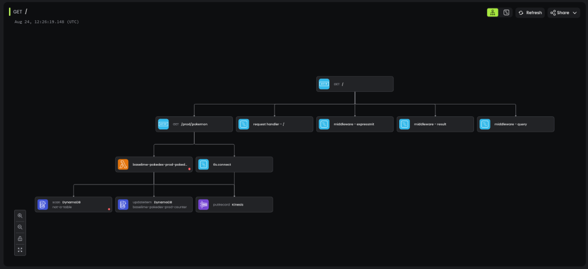

# OpenTelemetry for Node.js

The [Baselime Node.js OpenTelemetry SDK](https://github.com/baselime/node-opentelemetry) enables you to instrument your Node.js services with OpenTelemetry without the boilerplate of using the OpenTelemetry SDK directly.

This SDK uses [OpenTelemetry for JavaScript](https://opentelemetry.io/docs/instrumentation/js/) and provides a layer that facilitates instrumenting your Node.js applications.

!!!
If your application is already instrumented with [OpenTelemetry](https://opentelemetry.io/), you can start sending your tracing data to Baselime without any additional code changes.

Add the Baselime OpenTelemetry endpoint to your exporter:
- Endpoint `https://otel.baselime.io/v1/`
- Header: `x-api-key: <BASELIME_API_KEY>` 
!!!

---

## Instrumentation

### Step 1: Install the SDKs

Install the [Baselime Node.js OpenTelemetry SDK](https://github.com/baselime/node-opentelemetry). 

```bash # :icon-terminal: terminal
npm i --save \
  @baselime/node-opentelemetry \
  @opentelemetry/auto-instrumentations-node
```

### Step 2: Initialise the tracer

Create a `tracing.js` file

``` javascript # :icon-code: src/tracing.js
const { BaselimeSDK } = require('@baselime/node-opentelemetry');
const { getNodeAutoInstrumentations } = require('@opentelemetry/auto-instrumentations-node');


const sdk = new BaselimeSDK({
  instrumentations: [
    getNodeAutoInstrumentations(),
  ],
});

sdk.start();
```

### Step 3: Set the Baselime environment variables

Set the environment variables of your comntainer service to include the Baselime API Key and set the NODE_OPTIONS enviroment variable to preload the OpenTelemetry SDK into your application.

| Key          | Value                                       | Description                                                                         |
| ------------ | --------------------------------------------- | ----------------------------------------------------------------------------------- |
| BASELIME_KEY | `your-api-key`               | Get this key from the [Baselime console](https://console.baselime.io) or the [Baselime CLI](https://github.com/Baselime/cli) |
| NODE_OPTIONS | `-r ./src/tracing.js` | Preloads the OpenTelemetry SDK at startup                                                 |

Once these steps are completed, distributed traces from your Node.js container applications should be available in Baselime to query via the console or the Baselime CLI.



---

## Configuration

The `BaselimeSDK` class of the [Baselime Node.js OpenTelemetry SDK](https://github.com/baselime/node-opentelemetry) takes the following configuration options.

| Field            | Type                    | Description                          |
| ---------------- | ----------------------- | ------------------------------------ |
| `instrumentations` | `InstrumentationOption[]` | An array of instrumentation options |
| `baselimeKey`      | `string` (optional)       | The Baselime API key                    |
| `collectorUrl`     | `string` (optional)       | The URL of the collector            |
| `service`          | `string` (optional)       | The service name                    |
| `namespace`        | `string` (optional)       | The namespace                       |
