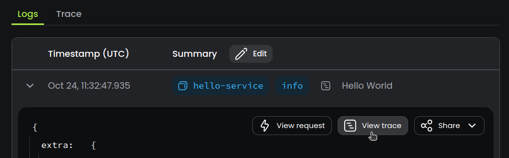

# Correlate Logs with Traces

Baselime enables you to correlate your logs with your distributed traces. For platforms with direct deep integrations such as AWS Lambda or Vercel, this is done automatically.

If you send your logs and traces to Baselime manually, adding a `traceId` field to your logs will enable logs and traces correlation.

--- 

## How it works

To enable correlating your logs and traces, add the `traceId` to your logs.

```javascript # 
import * as api from '@opentelemetry/api';

const span = api.trace.getActiveSpan();
const { traceId } = span?.spanContext();

console.log(JSON.stringify({ message: "Hello World!", traceId }));
```

If you use a custom logger, we recommend the `traceId` to all the logs by default.

There are a set of instrumentation packages for major logging libraries; for example:

- Winston: [@opentelemetry/instrumentation-winston](https://www.npmjs.com/package/@opentelemetry/instrumentation-winston)
- Pino: [@opentelemetry/instrumentation-pino](https://www.npmjs.com/package/@opentelemetry/instrumentation-pino)

Search your favourite package manager for the OpenTelemetry instrumentation of your favourite logger.

---

## Usage

Baselime will automatically correlate your logs and traces and you will be able to view the trace associated with a log, or from the trace, hop into the associated logs.



