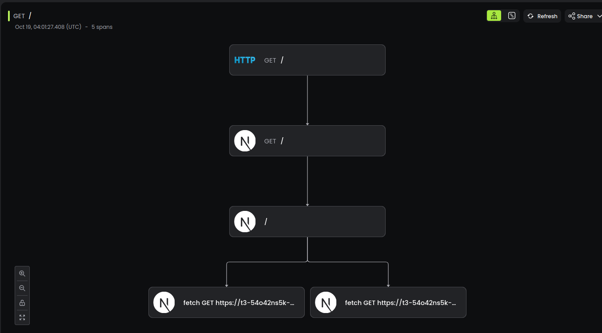

# OpenTelemetry for Next.js

Learn how to use [OpenTelemetry](https://opentelemetry.io/) and Baselime to trace your [Next.js](https://nextjs.org/) application.


!!!
If your deploy your Next.js on Vercel, install the [Baselime Integration](https://vercel.com/integrations/baselime) to enable logs in addition to distributed tracing.
!!!

## Instrumentation

### Step 1: Install the `@baselime/node-opentelemetry`


Inside your Next.js project install the Baselime Node OpenTelemetry SDK

```bash # :icon-terminal: terminal
npm i @baselime/node-opentelemetry 
```

### Step 2: Initialise the tracer

Next, create an `instrumentation.ts` file in the root of your project and add the following code to initialize and configure OpenTelemetry.

!!!
If you have a src/ folder the `instrumentation.ts` file needs to go in there
!!!

```typescript # :icon-code: instrumentation.ts
export async function register() {
  if (process.env.NEXT_RUNTIME === 'nodejs') {
    const { BaselimeSDK, VercelPlugin, BetterHttpInstrumentation } = await import('@baselime/node-opentelemetry');

    const sdk = new BaselimeSDK({
      serverless: true,
      service: "your-project-name",
      instrumentations: [
        new BetterHttpInstrumentation({ 
          plugins: [
            new VercelPlugin() // Add our vercel plugin to get log trace correlation to projects deployed to vercel
          ]
        }),
      ]
    });

    sdk.start();
  }
}
```

### Step 3: Set the Baselime environment variables

Set the environment variables of your service to include the Baselime API Key

| Key          | Value          | Description                                                                                                                  |
| ------------ | -------------- | ---------------------------------------------------------------------------------------------------------------------------- |
| BASELIME_KEY | `your-api-key` | Get this key from the [Baselime console](https://console.baselime.io) or the [Baselime CLI](https://github.com/Baselime/cli) |  |


### Step 4. Enable Next.js Auto Instrumentation

Next.js 13.4+ supports auto-instrumentation. To use this feature, add `experimental.instrumentationHook = true` to your [`next.config.js`](https://nextjs.org/docs/app/api-reference/next-config-js).

!!!
For more information read the [Next.js OpenTelemetry Documentation](https://nextjs.org/docs/pages/building-your-application/optimizing/open-telemetry)
!!!

```typescript # :icon-code: next.config.mjs
await import("./src/env.mjs");

/** @type {import("next").NextConfig} */
const config = {
    experimental: {
        instrumentationHook: true,
    }
};

export default config;
```

Once these steps are completed, distributed traces from your Node.js container applications should be available in Baselime to query via the console or the Baselime CLI.



---

## Trace your favorite libraries

Getting a great experience from OpenTelemetry requires you to install the right instrumentations for your project. Here are some of the instrumentations supported by Baselime.

<!-- A markdown table -->

| Instrumentation | Icons in the Baselime Console |
| --------------- | --- |
| [Prisma](https://www.prisma.io/docs/concepts/components/prisma-client/opentelemetry-tracing) | ✅ |
| [TRPC](https://github.com/baselime/node-opentelemetry/blob/main/TRPC.md) | ✅ |
| [AWS SDK](https://www.npmjs.com/package/@opentelemetry/instrumentation-aws-sdk) | ✅ |

If your favorite library is not in this list get in touch we would love to add it.


## Adding custom OpenTelemetry spans

To add custom spans to your OpenTelemetry traces, install the `@opentelemetry/api` package.

```bash # :icon-terminal: terminal
npm i @opentelemetry/api
```

And manually add spans to your traces.

```js # :icon-code: page.js
import { trace } from "@opentelemetry/api";
import { useSearchParams } from 'next/navigation'
 
const tracer = trace.getTracer('your-custom-traces');

export default async function Home({}) {
    const searchParams = useSearchParams()
 
  const search = searchParams.get('search')
  const span = trace.getActiveSpan();
  
  span.setAttribute('search', search)

  const result = await tracer.startActiveSpan(`business-logic`, async (span) => {
    // your business logic
    const input = { search }
    span.setAttributes(input);
    const result = await yourBusinessLogic(input)
    span.setAttributes(result)
    return result
  });

  return (
    <main className="flex min-h-screen ...">
      <div className="container flex flex-col items-center justify-center gap-12 px-4 py-16 ">
        ...
        </div>
    </main>
  )
}
```