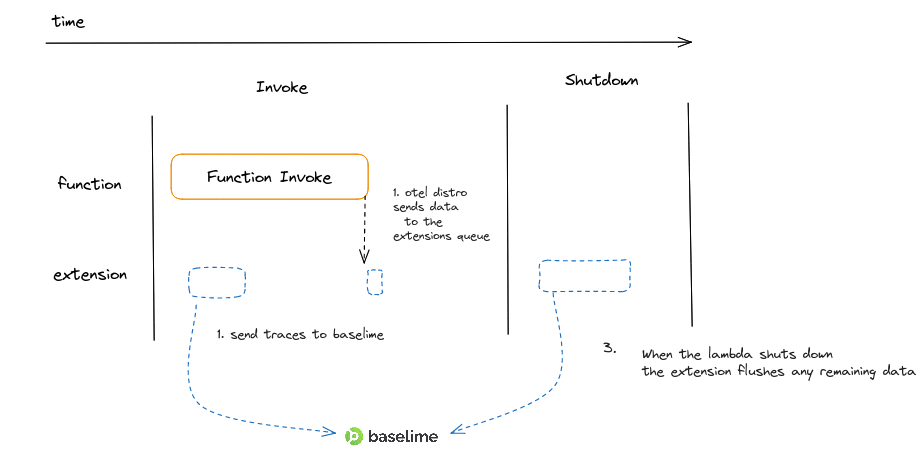

# OpenTelemetry Traces

---

If your codebase is already instrumented with [OpenTelemetry](https://opentelemetry.io/), you can start sending us your tracing data today.

Add the Baselime OTel endpoint to your exporter:
- Endpoint `https://otel.baselime.io/v1/`
- Header: `x-api-key: <YOUR_BASELIME_API_KEY>` 

You can get your Baselime API key from the Baselime CLI with 

```bash # :icon-terminal: terminal
baselime iam
```

If you have not instrumented your codebase with OTel yet, you can use the [Baselime Node.js OTel tracer](https://github.com/Baselime/lambda-node-opentelemetry) as outlined below. We're currently working on lightweight OTel tracers for other languages.

---

# Lambda Opentelemetry for Node.JS

The `@baselime/lambda-node-opentelemetry` package instruments your lambda functions and automatically ships OTEL compatible trace data to Baselime. This is the most powerful and flexible way to instrument your node service.

## Automatic Instrumentation

Add the Baselime open telemetry tracer with no code changes. Tag your lambda function with `baselime:tracing=true`

### SST/CDK

To tag all functions add this to your sst.config.ts

```typescript
 Tags.of(app).add("baselime:tracing", `true`);
```


### Serverless Framework


```yaml
provider:
  name: aws
  tags:
    "baselime:tracing": "true"
```
<!-- 
### Architect -->

### SAM

```yaml
AWSTemplateFormatVersion: "2010-09-09"
Transform: AWS::Serverless-2016-10-31
Description: "Gets data from the xxxxx API."
Globals:
  Function:
    Tags:
       "baselime:tracing": "true"
```
### Manual Setup

Behind the scenes this makes a few changes to your lambda function via Baselimes AWS Integration.

Here is a peak under the hood:

1. Add the baselime-node layer - `arn:aws:lambda:${region:097948374213:layer:baselime-node:6`
2. Add the baselime-extension layer - `arn:aws:lambda:${region}:097948374213:layer:baselime-extension-${'x86_64' || 'arm64'}:1`
3. Set the handler to `/opt/nodejs/node_modules/@baselime/lambda-node-opentelemetry/handler.handler`
4. Set the BASELIME_ACTUAL_HANDLER environment variable. The value of this variable must be to the path of the handler of your AWS Lambda function, for example filename.handler
5. Set the BASELIME_KEY environment variable with the value of your environments Baselime api key

These changes are kept in sync via AWS Lambda Config Updated events from CloudTrail.


## Adding Custom Events

Our simple but powerful OTEL compatible logging extension lets you add context rich events to your traces. These events can be useful to show more detailed context on errors, add steps that you want recorded for a business process or simply add extra debug information.

```javascript
const { logger } = require("@baselime/lambda-node-opentelemetry");

logger.info("This is an informational message", {
  operation: "copy-paste-replace",
  count: 9000,
});
```

The extension provides an object that includes four logging functions - info, warn, debug, and error - enabling you to log messages with varying levels of severity. By setting the LOG_LEVEL environment variable, you can control the visibility of the logs.

```javascript
const { logger } = require("@baselime/lambda-node-opentelemetry");

logger.info("This is an informational message", { payload: { foo: "bar" } });
logger.warn("This is a warning message", { payload: { foo: "bar" } });
logger.debug("This is a debug message", { payload: { foo: "bar" } });
logger.error("This is an error message", { payload: { foo: "bar" } });
```

It shares the same interface as `@baselime/lambda-logger` so if you are moving from cloudwatch to open telemetry this makes the transision seamless.

### Adding custom spans

You can completely customise the traces you send. Install the `@opentelemetry/api` package and customise!

Add new spans for your important business logic

```javascript
import { trace } from "@opentelemetry/api";
const tracer = trace.getTracer('your-custom-traces');

const result = await tracer.startActiveSpan(`business-logic`, async (span) => {
  span.setAttributes(args)
  // simulate some random work.
  const result = await yourBusinessLogic(args)
  span.setAttributes(result)
  return result
});
```

or get the active span and enrich it with more data

```javascript
import { trace } from "@opentelemetry/api";

export async function handler(event) {
  const activeSpan = trace.getActiveSpan();

  const { userId } = JSON.parse(event.body);
  span.setAttribute('user', userId)

  // do something meaningful
}
```

All these spans and attributes can be queried in Baselime

For more information read the ....... manual

[OTEL Docs](https://opentelemetry.io/docs/instrumentation/js/manual/#acquiring-a-tracer)

## Manual Integration

Wrap your handlers with the `baselime.wrap(handler)` method.

Example

```javascript
import baselime from '@baselime/lambda-node-opentelemetry'

async function main(event, context) {
   // your lambda handler
}

export const handler = baselime.wrap(main);

```

For production systems you should remove the latency overhead of sending open telemetry data by adding the baselime-extension layer.

```javascript
`arn:aws:lambda:${region}:097948374213:layer:baselime-extension-${'x86_64' || 'arm64'}:1`
```



## Manual Installation

Install the `@baselime/lambda-node-opentelemetry` package

```bash
npm install @baselime/lambda-node-opentelemetry
```

Add the following environment variables to your service

| Key          | Example                                       | Description                                                                         |
| ------------ | --------------------------------------------- | ----------------------------------------------------------------------------------- |
| BASELIME_KEY | nora-is-the-cutest-baselime-dog               | Get this key from the [cli](https://github.com/Baselime/cli) running `baselime iam` |
| NODE_OPTIONS | --require @baselime/lambda-node-opentelemetry | Preloads the tracing sdk at startup                                                 |

Get the baselime key using our [cli](https://github.com/Baselime/cli) 

```bash
baselime iam
```

You need to make sure the lambda-wrapper file is included in the .zip file that is used by aws-lambda. The exact steps depend on the packaging step of the framework you are using.

> If you use `export const` `export function` or `export default` for your handler you need to rename it to a cjs export like `module.exports = ` or `exports.handler =`. Even if you use esbuild. We are tracking issues in [esbuild](https://github.com/evanw/esbuild/issues/1079) and [open-telemetry](https://github.com/open-telemetry/opentelemetry-js/issues/1946) and are looking to see how we can help out.


### Architect

Copy the lambda-wrapper.js file from our node modules to the shared folder of your architect project, this way it is automatically included in all of your lambdas bundles.

```bash
cp node_modules/@baselime/lambda-node-opentelemetry/lambda-wrapper.js src/shared/
```

Add the environment variables to your architect project

```bash
arc env -e production --add BASELIME_KEY tux-is-the-smartest-baselime-dog
arc env -e production --add -- NODE_OPTIONS '--require @architect/shared/lambda-wrapper'
```

> Watch out for the '--' in the NODE_OPTIONS command. This is required to escape options parsing.


### Serverless

By default the serverless framework includes your whole node_module directory in the .zip file. If you are using the `serverless-esbuild` plugin to avoid this then you need to add the following configuration to your project.

https://www.serverless.com/framework/docs/providers/aws/guide/packaging

Add the following line to the `package.patterns` block of your serverless.yml

```yaml
- 'node_modules/@baselime/lambda-node-opentelemetry/lambda-wrapper.js'
```

Example

```yaml
package:
  patterns:
    - 'node_modules/@baselime/lambda-node-opentelemetry'
```

Add the following environment variables
```yaml
    BASELIME_KEY: ${env:BASELIME_KEY}
    NODE_OPTIONS: '--require @baselime/lambda-node-opentelemetry/lambda-wrapper'
```

### SST

> Fun fact Baselime is built using SST :)

Copy the lambda-wrapper file to your srcPath directory

```bash
cp node_modules/@baselime/lambda-node-opentelemetry/lambda-wrapper.js services
```

Then add the default props to include the wrapper in your bundle and add your environment variables


```javascript
app.setDefaultFunctionProps({
  runtime: "nodejs18.x",
  environment: {
    NODE_OPTIONS: '--require @baselime/lambda-node-opentelemetry/lambda-wrapper',
    BASELIME_SERVICE: stack.stackName,
    BASELIME_KEY: process.env.BASELIME_KEY
  },
  nodejs: {
    install: ["@baselime/lambda-node-opentelemetry"],
  },
});
```

## Send data to another OpenTelemetry Backend

Add the environment variable `COLLECTOR_URL` to send the spans somewhere else.