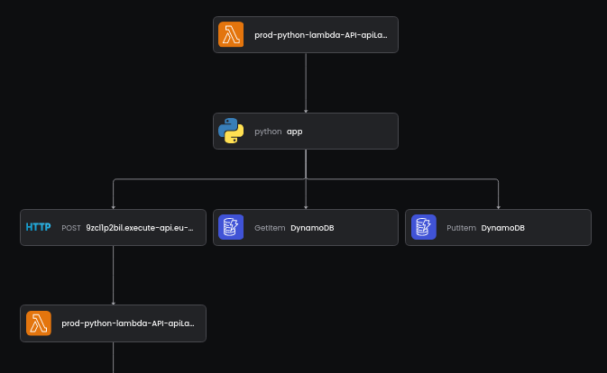

# OpenTelemetry for AWS Lambda

To automatically instrument your AWS Lambda functions with the [Baselime Node.js OpenTelemetry tracer for AWS Lambda](https://github.com/Baselime/lambda-node-opentelemetry), set the following tag to your AWS Lambda functions: `baselime:tracing=true`.





+++ AWS CDK

To add the Baselime tag to all your AWS Lambda functions in a service or stack add this line to your AWS CDK code.

```typescript #
 Tags.of(app).add("baselime:tracing", `true`);
```

+++ SST

To add the Baselime tag to all your AWS Lambda functions in a service or stack add this line to your `sst.config.ts` file.

```typescript #
 Tags.of(app).add("baselime:tracing", `true`);
```

+++ Serverless Framework

To add the Baselime tag to all your AWS Lambda functions in a add this snippet to your `serverless.yml` file.

```yaml #
provider:
  name: aws
  tags:
    "baselime:tracing": "true"
```

+++ AWS SAM

To add the Baselime tag to all your AWS Lambda functions in a add this snippet to your AWS SAM configuration file.

```yaml #
AWSTemplateFormatVersion: "2010-09-09"
Transform: AWS::Serverless-2016-10-31
Description: "Gets data from the xxxxx API."
Globals:
  Function:
    Tags:
       "baselime:tracing": "true"
```

+++

!!!warning
Other observability tool layers and tags can adversely interact with the Baselime OpenTelemetry layer. We recommend to disable all other observability layers and tags before instrumenting your AWS Lambda functions with the Baselime OpenTelemetry layer. Failing to do so could result in down-time.  
!!!

---

## Runtimes

[!ref icon="../../../../../assets/images/logos/node.svg"](./node.js.md)
[!ref icon="../../../../../assets/images/logos/python.svg"](./python.md)

---

## Remove OpenTelemetry
To remove the OpenTelemetry instrumentation from your AWS Lambda functions, remove the `baselime:tracing=true` tag from the function and Baselime will revert the function to un-instrumentate state.

---

## Sending data to another OpenTelemetry backend

OpenTelemetry is an open standard, and you can use the [Baselime Node.js OpenTelemetry tracer for AWS Lambda](https://github.com/Baselime/lambda-node-opentelemetry) to send telemetry data to another backend of your choice.

Set environment variable `COLLECTOR_URL` to your observability backend.
