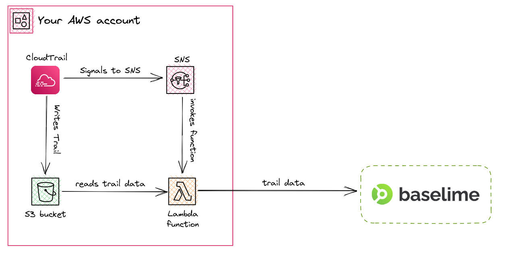

# Amazon CloudTrail

Baselime automatically ingests Amazon CloudTrail events when you connect your AWS account. Baselime will automatically create a new Amazon CloudTrail trail and an Amazon S3 bucket, and configure both to send data to your Baselime account. No additional setup is required.

Once connected, Amazon CloudTrail events will be sent to Baselime and become available for querying.

---

## Why Amazon CloudTrail ?

[Amazon CloudTrail](https://aws.amazon.com/cloudtrail/) is a service provided by AWS that records API activity in your AWS account. This data can be used to track changes to your resources, troubleshoot issues, and improve security.

By sending Amazon CloudTrail events to Baselime, you can use our query and visualization tools to analyze and understand your API activity. You can also set up alerts to be notified of specific API activity or trends.

With Amazon CloudTrail events in Baselime, you can gain a deeper understanding of your AWS API activity and use that knowledge to improve the security and reliability of your applications.

---

## How it works

Amazon CloudTrail periodically writes trail data in a pre-configured Amazon S3 bucket in your AWS account. Once the data is written, an Amazon SNS topic is triggered.

Baselime configures this Amazon SNS to invoke an AWS Lambda function. This function reads the data from the bucket and sends it to the Baselime backend.

---

## Amazon CloudTrail management events

Amazon CloudTrail events fall into multiple categories, and Baselime automatically ingests CloudTrail management events. Please refer to the complete [CloudTrail docs](https://docs.aws.amazon.com/awscloudtrail/latest/userguide/cloudtrail-concepts.html) for further details on the CloudTrail concepts. 

