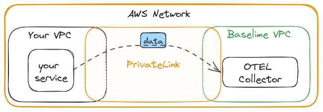

# AWS PrivateLink for OpenTelemetry

Baselime supports AWS PrivateLink, enabling you to securely send the data directly from your VPC to Baselime's platform without exposing your data to the public internet.

!!!info
Endpoint service name: `com.amazonaws.vpce.eu-west-1.vpce-svc-03611009d136b2d65`

Use name: `otel-ingest.baselime.io` instead of `otel.baselime.io` in your OTEL exporter when using PrivateLink.
!!!

## How to set it up
+++ AWS Console
* Navigate to "VPC" > "Endpoints" > "Create Endpoint"
  * Select "PrivateLink" as the service category.
  * Search for "todo" in the service name.
  * Select the VPC and subnets you want to associate with the endpoint.
  * Create a security group for your endpoint.
    * Make sure the security group allows outbound traffic to CIDR of the VPC or specific subnet of that VPC you selected in the previous step.
    * Make sure the security group allows inbound traffic from CIDR of the VPC or specific subnet of that VPC you selected in the previous step.
  * Click on "Create Endpoint".
* Wait for the endpoint to be created and accepted by Baselime.
* Once accepted navigate to "VPC" > "Endpoints" and select the endpoint you just created.
  * "Actions" > "Modify private DNS name" > Tick "Enable private DNS names" > "Save changes"


+++ CDK
```typescript
import * as ec2 from '@aws-cdk/aws-ec2';
import * as cdk from '@aws-cdk/core';

// Create or import your VPC
const vpc = ec2.Vpc.fromLookup(this, "vpc", {
    vpcId: "your-vpc-id",
});

// Create Security Group allowing inbound traffic from your VPC CIDR
const sg = new ec2.SecurityGroup(this, "SecurityGroup", {
  vpc,
  allowAllOutbound: true,
  description: "Security group for Baselime VPC Endpoint",
  securityGroupName: "baselime-endpoint-sg",
});
sg.addIngressRule(ec2.Peer.ipv4(vpc.vpcCidrBlock), ec2.Port.tcp(443), "Allow HTTPS ingress");
sg.addIngressRule(ec2.Peer.ipv4(vpc.vpcCidrBlock), ec2.Port.tcp(4317), "Allow gRPC ingress");


// Create Endpoint for Baselime OTEL
const endpoint = new ec2.InterfaceVpcEndpoint(this, 'Endpoint', {
  service: new ec2.InterfaceVpcEndpointService('com.amazonaws.vpce.eu-west-1.vpce-svc-03611009d136b2d65', 443),
  vpc: vpc,
  subnets: {
    subnetType: ec2.SubnetType.PRIVATE,
  },
  // Enable private DNS names once accepted on our side
  privateDnsEnabled: hasBeenAccepted,
  securityGroups: [sg],
});
```

+++ Terraform
```terraform
// Create or import your VPC

// Create Security Group allowing inbound traffic from your VPC CIDR
resource "aws_security_group" "baselime-otel" {
  name        = "baselime-otel-endpoint-sg"
  description = "Security group for Baselime OTEL VPC Endpoint"
  vpc_id      = aws_vpc.main.id

  ingress {
    description = "Allow HTTPS ingress"
    from_port   = 443
    to_port     = 443
    protocol    = "tcp"
    cidr_blocks = [aws_vpc.main.cidr_block]
  }

  ingress {
    description = "Allow gRPC ingress"
    from_port   = 4317
    to_port     = 4317
    protocol    = "tcp"
    cidr_blocks = [aws_vpc.main.cidr_block]
  }

  egress {
    from_port   = 0
    to_port     = 0
    protocol    = "-1"
    cidr_blocks = [aws_vpc.main.cidr_block]
  }
}

resource "aws_vpc_endpoint" "baselime-otel" {
  vpc_id              = aws_vpc.main.id
  service_name        = "com.amazonaws.vpce.eu-west-1.vpce-svc-03611009d136b2d65"
  vpc_endpoint_type   = "Interface"
  security_group_ids  = [aws_security_group.baselime-otel.id]
  private_dns_enabled = true
  subnet_ids          = aws_subnet.private.*.id
}
```
+++

After about 60 seconds all your traffic to `otel-ingest.baselime.io` will be routed through the PrivateLink.

## How it works

#### Without PrivateLink Endpoint
When using Baselime without a PrivateLink endpoint, the DNS `otel-ingest.baslime.io` resolves to the public
IP address of Baselime's platform. Your OTEL collector then sends the telemetry data to Baselime's platform
over the public internet. Our endpoints are protected by TLS, so your data is encrypted in transit.


#### With PrivateLink Endpoint
When using Baselime with a PrivateLink endpoint, the DNS `otel-ingest.baslime.io` resolves the the private IP of a Network
Interface that exists in your VPC, and the IP itself is one of from the CIDR range of your VPC. Your OTEL collector
then sends the data to Baselime's platform over the private network. This means that your data never leaves AWS
infrastructure, and is never exposed to the public internet.



Read more about [AWS PrivateLink](https://aws.amazon.com/privatelink/) on the AWS website.
