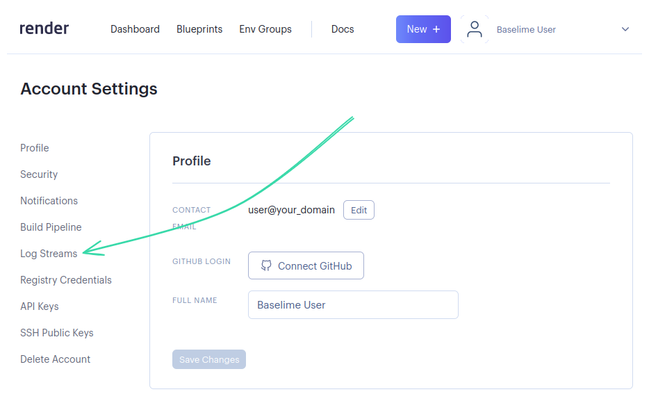
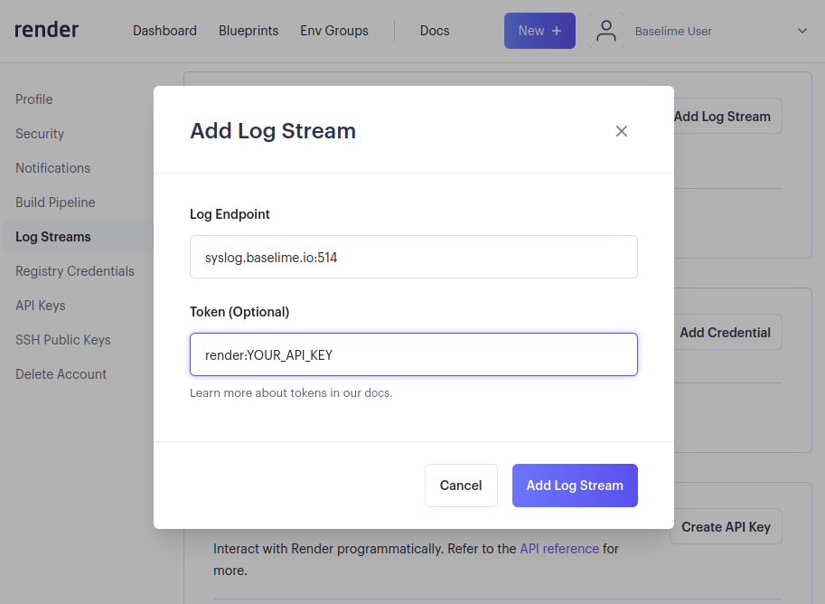

# Render

Render is a cloud platform for hosting and deploying web applications and websites. It provides a way to securely stream logs from your services deployed on Render to Baselime using the [Syslog protocol](https://en.wikipedia.org/wiki/Syslog) over [TLS](https://en.wikipedia.org/wiki/Transport_Layer_Security).

---

## Baselime integration

Baselime provides advance logging capabilities for servoces deployed on Render. You can start streaming your logs from Render in a few steps:

### Step 1. Create an environment on Baselime

Navigate to the [Baselime console](https://console.baselime.io), create and environment and select "Connect Render account".

Once the environment is created, copy the `BASELIME_API_KEY`.

### Step 2. Create the Log Stream in Render

Navigate to your [Render dashboard](https://dashboard.render.com/u/usr-0/settings), select Log Streams, and Add Log Stream.

### Step 3. Configure the Log Stream

- Set `Log Endpoint` to `syslog.baselime.io:514`
- Set `Token` to `render:BASELIME_API_KEY`
- Add the Log Stream

!!!
Replace `BASELIME_API_KEY` with the API key from the Baselime console is Step 1.
!!!

!!!
Make sure to prefix the `Token` with `render:`. This enables Baselime to adequately parse logs from Render and enable you to run complex queries on them.
!!!

### Step 4. Use your logs from Render

Once the Log Stream is created, all your logs from Render will be available in Baselime for searching, queries, dashboard and alerts.

