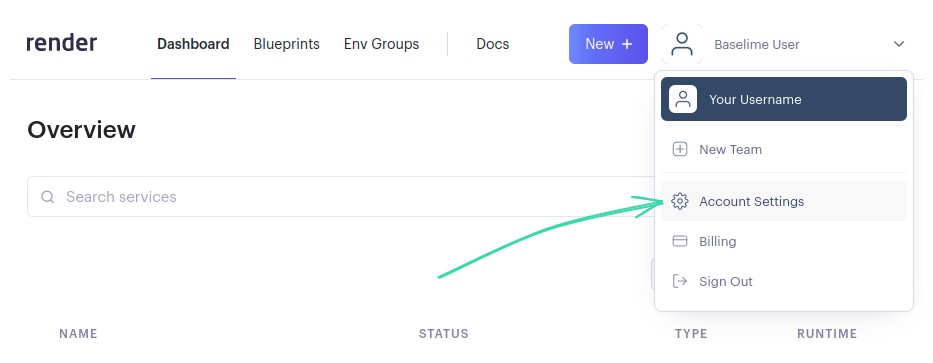
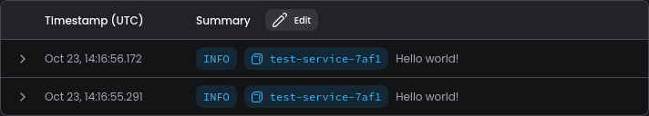

# Render Logs

You can securely stream your [Render.com](https://render.com/) services logs using SysLog protocol over TLS.

## How to use Render with Baselime?

1. Obtain the API key from the
[Baselime console](https://console.baselime.io).

2. Navigate to [Render.com](https://render.com/)

3. Click on your username in the top right corner and select **Account Settings**.

4. Select **Log Streams** from the left menu.

5. Click on **Add Log Stream** button. 
   1. Set **Log Endpoint** to `syslog.baselime.io:514`
   2. Set **Token** to `render:YOUR_API_KEY`

!!! Note
Replace `YOUR_API_TOKEN` with token obtained from the Baselime console. But make sure
the token starts with `render:`!
!!!

6. Click on **Add Log Stream** button.
7. You should start to see your logs in Baselime console.

