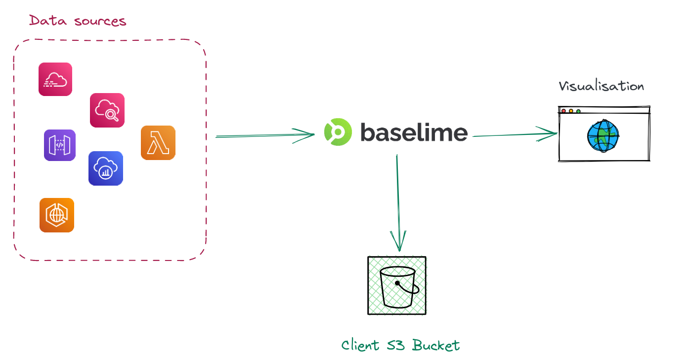
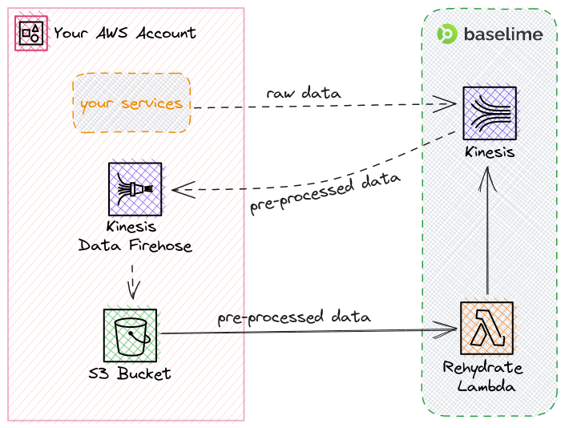

# Rehydrating telemetry data from Amazon S3

This page describes how you can rehydrate your telemetry data from Amazon S3 into Baselime.

Once received, all telemetry data from your AWS Accounts is securely stored in hot storage for querying and in cold storage within your own AWS environment, in an **Amazon S3 bucket in your AWS account**. This ensures that you have complete long-term control over your data and its storage location.



!!!
The retention period of your telemetry data on Baselime is independent of the retention periods in AWS. You can safely reduce the retention period of your CloudWatch log groups.
!!!

---

## How it works

When your data is streamed to Baselime, through different sources described in the [Sending Data to Baselime](./) section,
it is also streamed to a Kinesis Firehose created in your AWS account. The Data Firehose stores
the telemetry data in a S3 bucket in your AWS account.

This gives you full ownership of your data and enables you to use it outside the Baselime; for example to feed it into a data lake. It is also possible to rehydrate the data from the S3 bucket into Baselime once the data is past its expiration period on Baselime.




!!! Note
We set the default TTL for objects stored in the bucket to 180 days to prevent extremely long storage of telemetry data you might not need; Feel free to adjust it to your needs.
!!!

---

## How to use it
First, you'll need to have Baselime CLI installed. You can find the installation instructions [here](../cli/install.md).

Once you have it installed, you can use the following command to rehydrate your data:

```bash
baselime rehydrate --startDate 2023-06-08T13:24:47.906Z --hoursToRecover 1
```
Start date should be formatted in RFC3339 format, and hours to recover should be a number.
The process will recover all the data from the start date, for the number of consecutive hours from that date.