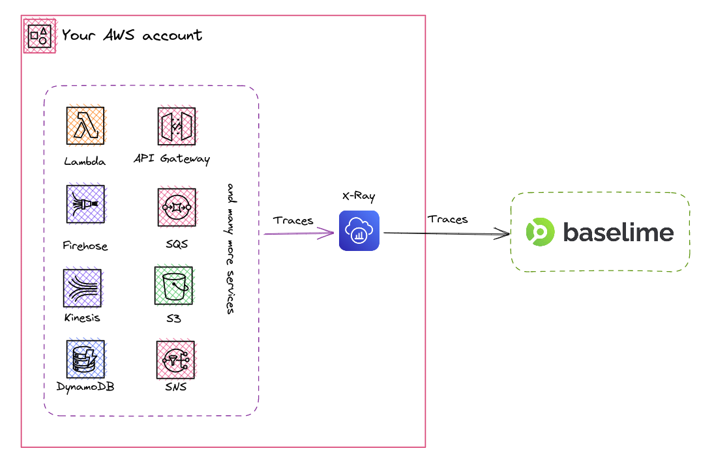

# AWS X-Ray Traces

[AWS X-Ray](https://aws.amazon.com/xray/) enables developers to gather traces across their distributed services. In order to gain visibility into their applications, developers can use AWS X-Ray to trace requests as they travel through their application, and collect data about the performance of their application.

Baselime enables you to ingest this tracing data and make it available for analysis and troubleshooting.

---

## How it works

To start ingesting traces from AWS X-Ray to Baselime, you'll need to [connect your AWS account to Baselime](../readme.md). Once connected, Baselime will periodically poll your AWS account for new traces and automatically ingest them into your Baselime dataset.

---

## Troubleshooting

If you're having trouble sending data from AWS X-Ray to Baselime, here are a few things to check:

- Verify that your AWS account is correctly connected to Baselime and you receive data in other datasets such as [CloudWatch Metrics](./cloudwatch-metrics.md) or [CloudTrail Events](./cloudtrail.md)
- Check that the Baselime IAM user has the appropriate permissions to access X-Ray
- Make sure that your applications emit X-Ray traces and you can view the traces in the X-Ray section of the AWS Console
