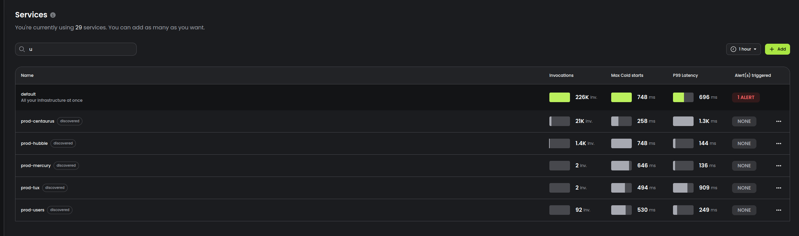
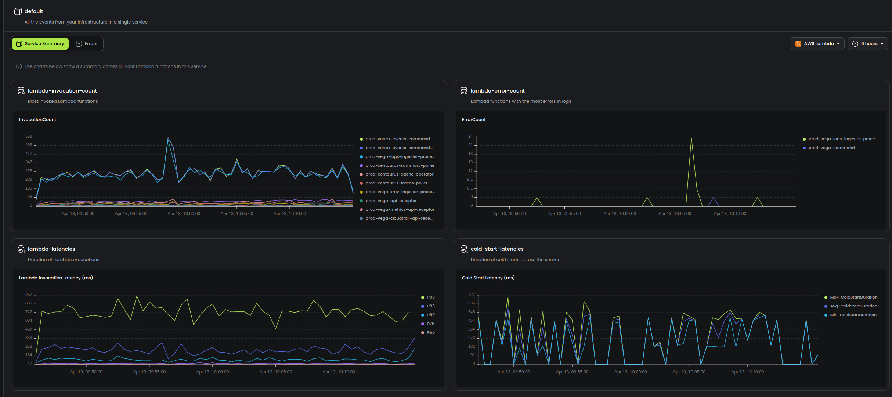

# Service Discovery for AWS

Baselime organises your observability data around your services, we do this by creating a dictionary of resources within your AWS account. The services are based around your CloudFormation stacks and customised for your specific deployment framework like SST which often deploys multiple stacks per service. The services are created and synced within Baselime automatically and synced automatically when you deploy changes.

Then when we ingest your logs, metrics and traces the events are then automatically tagged with the service they belong to you can fully understand how your systems are operating. Baselime does not charge for number of services but rather number of events, so their are no limits on the number of services or resources you can have in your workspace.

## Service Home

Each service gets a home view which displays summary stats about the discovered services grouped by the types of resources in that service. The time range and resource type is adjustable using the drop down in the top right corner. A list of all the errros based on log-level error and uncaught exceptions is on the second tab.

### Supported services

Currently there are pregenerated dashboards for lambda, dynamodb, sqs, and kinesis - if you have resources that you want to see in this page tell us about it in the [slack community](https://baselimecommunity.slack.com/join/shared_invite/zt-1eu7l0ag1-wxYXQV6Fr_aiB3ZPm3LhDQ) and we will add it right away.