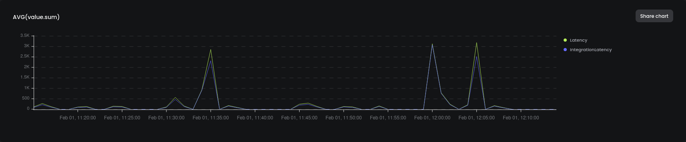

# Templates for API Backends

Monitor your API Backends with the Starter template for queries, and alerts. These queries use your Api Gateway Logs, and CloudWatch Metrics to help you make sure your API's are scalable and have great uptime.

## Required Datasets

| Dataset | Docs  |
|---------|-------|
| apigateway-logs | https://docs.baselime.io/sending-data/apigateway-logs/ |
| cloudwatch-metrics | https://docs.baselime.io/sending-data/cloudwatch-metrics/ |

### Queries

| Name | Description | Dataset | ID |
|------|-------------|---------|----|
| API Latency | Provides stats on API latency (AVG, P90, P95, P99) | apigateway-logs | [api-latency](https://github.com/Baselime/templates/tree/main/templates/api-backends/api-latency.yml) |
| API Integration Latency | The speed of API gateway compared to the speed integration | apigateway-logs | [api-integration-latency](https://github.com/Baselime/templates/tree/main/templates/api-backends/api-integration-latency.yml)
| API Errors | Counts the number of API errors and groups by status | apigateway-logs | [api-errors](https://github.com/Baselime/templates/tree/main/templates/api-backends/errors.yml) |
| API Overview | Sums the values of API metrics | cloudwatch-metrics | [api-overview](https://github.com/Baselime/templates/tree/main/templates/api-backends/api-overview.yml) |
| Request Count | Counts the number of requests | apigateway-logs | [request-count](https://github.com/Baselime/templates/tree/main/templates/api-backends/request-count.yml) |

### Alarms

| Name | Description | Triggered by | Threshold | Window |
|------|-------------|-------------|----|----------|
| API Latency Alarm | Triggers an alarm if the AVG response latency is over a threshold | api-latency |  `> 4000` | `60mins` |
| API Errors Alarm | Triggers an alarm if the count of API errors is over a threshold | api-errors |  `> 10` | `10mins` |
| Request Count Alarm | Triggers an alarm if the count of requests is over a threshold | request-count |  `> 60000` | `1min` |

## Combos

This template works great with

* [Lambda Logs Basics](../lambda-logs-basics/)

