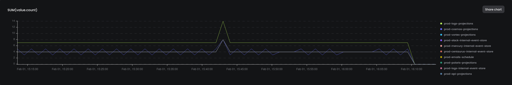

# Templates for DynamoDB

Monitor DynamoDB Performance with the baselime dynamodb template. These queries use your CloudWatch Metrics to show you how your tables are performing

## Datasets

| Dataset | Docs  |
|---------|-------|
| cloudwatch-metrics | https://docs.baselime.io/sending-data/cloudwatch-metrics/ |

### Queries

| Name | Description | Dataset | Id |
|------|-------------|---------|----|
| DynamoDB Consumed Write Capacity | How much write capacity you have consumed | cloudwatch-metrics | [dynamodb-consumed-write-capacity](https://github.com/Baselime/templates/tree/main/templates/dynamodb/capacity.yml) |
| DynamoDB Consumed Read Capacity | How much read capacity you have consumed | cloudwatch-metrics | [dynamodb-consumed-read-capacity](https://github.com/Baselime/templates/tree/main/templates/dynamodb/capacity.yml) |
| Scan Latency | Duration of scans | cloudwatch-metrics | [scan-latency](https://github.com/Baselime/templates/tree/main/templates/dynamodb/scan.yml) |
| Scan Items Returned | Number of items returned by a scan | cloudwatch-metrics | [scan-items-returned](https://github.com/Baselime/templates/tree/main/templates/dynamodb/scan.yml) |
| Scans | Number of scans | cloudwatch-metrics | [scan-count](https://github.com/Baselime/templates/tree/main/templates/dynamodb/scan.yml) |
| Slow Put Item Requests | The 10 slowest Put Item requests Grouped By Table | cloudwatch-metrics | [slow-put-item-requests](https://github.com/Baselime/templates/tree/main/templates/dynamodb/slow-operations.yml)
| Slow Get Item Requests | The 10 slowest Put Item requests Grouped By Table | cloudwatch-metrics | [slow-get-item-requests](https://github.com/Baselime/templates/tree/main/templates/dynamodb/slow-operations.yml)
| Slow Update Item Requests | The 10 slowest Update Item requests Grouped By Table | cloudwatch-metrics | [slow-update-item-requests](https://github.com/Baselime/templates/tree/main/templates/dynamodb/slow-operations.yml) |
| Records Processed By A Stream | How many records have you processed with dynamodb streams | cloudwatch-metrics | [dynamodb-streams](https://github.com/Baselime/templates/tree/main/templates/dynamodb/streams.yml) | 

### Alarms

| Name | Description | Triggered by | Threshold | Window |
|------|-------------|-------------|----|----------|
| Friends don't let friends run scans | If the scan count is more than 10 for a 10 minute window alert | scan-count | `> 10` | `10mins` |