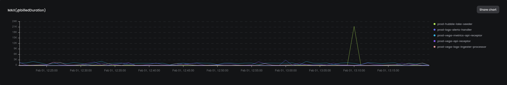

# Templates for Lambdas

Monitor your Lambda functions with the Starter template full of queries, and alerts. These queries use your lambda-logs, to make sure your Lambdas are running great!

## Datasets

| Dataset | Docs  |
|---------|-------|
| lambda-logs | https://docs.baselime.io/sending-data/lambda-logs/ |

### Queries

| Name | Description | Dataset | ID |
|------|-------------|---------|----|
| Highest Billed Duration Invocations | Invocations with the highed billed duration | lambda-logs | [highest-billed-invocation](https://github.com/Baselime/templates/tree/main/templates/lambda-logs-basics/highest-billed-invocation.yml) |
| Duration of lambda cold-starts | Statistics on the duration of lambda cold starts across the application | lambda-logs | [lambda-cold-start-duration](https://github.com/Baselime/templates/tree/main/templates/lambda-logs-basics/lambda-cold-start-duration.yml)
| Events with LogLevel ERROR | Count of the number of events with LogLevel ERROR | lambda-logs | [lambda-errors](https://github.com/Baselime/templates/tree/main/templates/lambda-logs-basics/lambda-errors.yml)
| Duration of lambda invocations | Max and P99 duration for lambda invocations | lambda-logs | [lambda-invocations-durations](https://github.com/Baselime/templates/tree/main/templates/lambda-logs-basics/lambda-invocations-durations.yml)
| Lambda Timeouts| Lambda Invocations that reported a timeout | lambda-logs | [timeouts](https://github.com/Baselime/templates/tree/main/templates/lambda-logs-basics/timeouts.yml)

### Alarms

| Name | Description | Triggered by  | Threshold | Window |
|------|-------------|----------------|----------|--------|
| Errors during Lambda invocations | There were more than {{ threshold }} errors over the past 30mins | lambda-errors | `> 10` | `30mins` |
| Lambda invocations timeouts | There were more than 5 timeouts over the past 30mins | timeouts | `> 5` | `30mins` |
