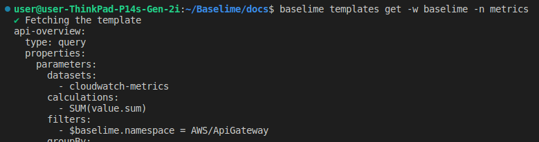
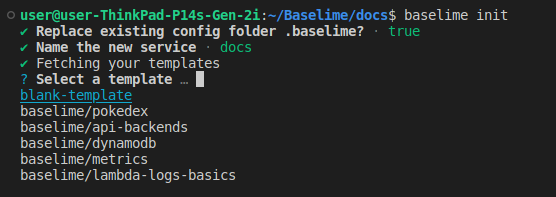

# Templates

Templates are a powerful way to share patterns and best practices when it comes to observing your Serverless app. A template is a collection of `.yml` files that contain [queries](../analysing-data/queries.md), [alerts](../analysing-data/alerts.md). Templates can be shared publicly or within organisations to help teams consistently manage their O11y, and prevent us from all having to write the same lambda timeout alert for every project!

## Getting started

You can find the templates in the UI when creating new services, or through the [baselime cli](../cli/install.md).

To list the available templates run 

```bash
baselime templates list
```

To preview a template run

```bash
baselime templates get -w baselime -n metrics
```



> To save the template as a file you can run `baselime templates get -w baselime -n metrics > metrics.yml`. This uses the "redirection" operator to redirect the standard output to a file

## Adding templates to services

When you run `baselime init` to create a service you will be prompted to select templates that you can add.



The queries and alerts for this template will be available instantly.

To add templates to an existing service edit the `.baselime/index.yml` file, appending `- ${workspace}/${name}` to the templates array.

```yml
templates:
  - name: baselime/dynamodb
  - name: baselime/pokedex
```

## Becoming a template author

Anyone can publish a template to the Baselime Template Repository. All our example templates can be found on [github](https://github.com/Baselime/templates/tree/main/templates). If you would like an example templates for an AWS service or find a bug please create an [issue](https://github.com/Baselime/templates/issues)


> These templates are currently publicly accessible, to publish a private template please get in touch via the baselime-community slack channel

The templates are made up of 

* index.yml file
* {template}.yml files
* Optional Licence and README files

The index.yml at the root of the templates folder must contain

```yml
# index.yml
service: {{ template name }}
provider: aws
description: {{ template description}}
version: '1'
```

```yml
# my-first-template.yml
request-count:
  type: query
  properties:
    name: "Request Count"
    description: Total number of requests made to the API Gateway
    parameters:
      datasets:
        - apigateway-logs
      calculations:
        - COUNT
```

You can structure your queries and alerts into any number of files and directories as you would like. Each file can also contain multiple queries and alerts.

To publish a template run

```bash
baselime templates publish -p ./template-dir
```
