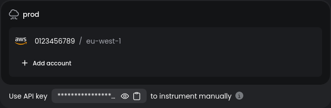

# Baselime CDK

Baselime natively integrates with any CDK or SST application to let you set up your applications observability along side your existing infrastructure. By defining your Observability resources along side your application using the CDK you get some awesome productivity benefits like being able to reuse the types and resources created by your IAC directly in your observability code.

```javascript
const api = new Api(stack, "api", {
  routes: {
    "GET /": "packages/functions/src/lambda.handler",
  },
});

new baselime.Query("api-get-resource-logs", {untill
  parameters: {
    datasets: ["lambda-logs"],
    filters: [{
      key: "$baselime.namespace",
      value: api.getFunction("GET /")?.functionName as string,
      operation: "=",
    }],
  },
});
```

These queries can then be used within your alerts and dashboards to paint a complete picture of how your application is performing

## Usage

### Setting up the Baselime CDK

The `@baselime/cdk` package should be installed in the same folder as your cdk application.

```bash
# Select your projects package manager
pnpm i --save-dev @baselime/cdk
npm i --save-dev @baselime/cdk
yarn add -D @baselime/cdk
```

Next and store your api key in ssm. You can find your api key in CLI when running

```bash
baselime iam
```

or download it from [console.baselime.io](https://console.baselime.io/)



Then add the parameter to SSM

```bash
aws ssm put-parameter --name "/baselime/api-key" --value "<baselime_api_key>" --type "SecureString"
```

> If you deploy your application to multiple aws accounts and multiple Baselime environments make sure you add a baselime api key per environment and prefix with the correct stage variable


Finally you can initialise `@baselime/cdk` in your CDK stack.


```javascript
import { StackContext, Api } from "sst/constructs";
import * as ssm from "aws-cdk-lib/aws-ssm";
import { Baselime } from "@baselime/cdk";

export function API({ stack }: StackContext) {

  baselime.init(stack, {
    // Remember to add a stage to your parameter if required
    apiKey: ssm.StringParameter.valueForStringParameter(stack, `/baselime/api-key`);,
  });

  const api = new Api(stack, "api", {
    routes: {
      "POST /subscription": "packages/functions/src/subscription.handler",
    },
  });
  stack.addOutputs({
    ApiEndpoint: api.url,
  });
}
```

### Instrumenting your application

Here we have an lambda function that creates a subscription. This is a critical flow within the application. We need to know about any problems asap but also the business metrics that it produces can tell us about harder to detect issues in other parts of the system. Using `@baselime/cdk` we are going to create a comprehensive set of alerts and a dashboard that gives us insight into the business metrics and performance of our application.

```javascript
const stripe = require('stripe')('sk_prod_bmljZSB0cnkgOykK');
const { logger } = require('@baselime/logger');

exports.handler = async (event) => {
  const { customerId, priceId } = JSON.parse(event.body);

  try {
    const subscription = await stripe.subscriptions.create({
      customer: customerId,
      items: [{ price: priceId }],
    });

    logger.info("Subscription created", {
        customerId, priceId, ammount_c: subscription.plan.amount
    });

    return {
      statusCode: 200,
      body: JSON.stringify(subscription),
    };
  } catch (error) {
    logger.error("Failure creating subscription", {
        customerId, priceId,
    }, error);

    return {
      statusCode: 500,
      body: JSON.stringify({ error: error.message }),
    };
  }
};
```

In this lambda function we have added structured json logs to each critical path of this application that give us context of what happens. The lambda runtime will also emit `START`, `END`, and `REPORT` logs that we can use to understand the performance of the application.
  
### Catching Errors

The first thing we want to do is set up alerts for any errors in our new lambda function. Our billing team want to be informed about any subscription related errors separately. This can be done by putting a custom target in the channel once the slack integration is set up

```javascript
const api = new Api(stack, "api", {
  routes: {
   "POST /subscription": "packages/functions/src/subscription.handler",
  },
});

const query = new Query("create-subscription-errors", {
  parameters: {
    datasets: ["lambda-logs"],
    calculations: [{ operation: "COUNT" }]
    filters: [{
      key: "$baselime.namespace",
      value: api.getFunction("POST /subscription")?.functionName as string,
      operation: "=",
    }, {
      key: "LogLevel",
      operation: 'IN'
      value: ["ERROR", "error"]
    }],
  },
});

query.addAlert({
   enabled: true,
    parameters: {
        frequency: "30mins",
        threshold: "> 0",
        window: "30 mins",
    },
    channels: [{ targets: ["billing-alerts"], type: "slack" }],
});
```

This adds a query and alert to your applications service in Baselime that notify you in slack when ever any log messages contain an error or Unhandled Exceptions caught by the lambda runtime. The alerts will check every 30 minutes for any errors.

The billing team come back and explain that they want to see the errors broken down by customer so they can see which customers where effected by the broken code.

```javascript
const query = new baselime.Query("create-subscription-errors", {
  parameters: {
    datasets: ["lambda-logs"],
    calculations: [{ operation: "COUNT" }]
    filters: [{
      key: "@baselime.namespace",
      value: api.getFunction("POST /subscription")?.functionName as string,
      operation: "=",
    }, {
      key: "LogLevel",
      operation: 'IN'
      value: ["ERROR", "error"]
    }],
    groupBy: {
      value: "@message.data.customerId",
      orderBy: "COUNT"
    }
  },
});
```

This now shows us exactly the customers that where effected by the outage.

### Business Metrics

O11y is not just for code errors. It's also about painting a richer picture of your application. Imagine the scenario where your company doesn't start any new subscriptions in a day. This is an example of where having sensible alerts and dashboards for your system metrics can spot issues in your whole application. i.e. maybe the new marketing campaign emails failed or your signup page has a glitch and the submit button has been set to `display:hidden;`. It's hard to write tests for every possibility but having alerts on key business metrics can give you useful feedback where tests cannot.

To do this we are going to set up a query that tracks the amount of revenue we are taking per hour.


```javascript
const revenueQuery = new baselime.Query("subscription", {
  parameters: {
    datasets: ["lambda-logs"],
    calculations: [{ operation: "SUM", key: "@message.data.ammount_c", alias: "Ammount in cents" }]
    filters: [{
      key: "@baselime.namespace",
      value: api.getFunction("POST /subscription")?.functionName as string,
      operation: "=",
    }, {
      key: "@message.message",
      operation: '='
      value: "Subscription created"
    }],
  },
});
```

We can then use this query in dashboards and alerts to show the performance of our business. 

```javascript
new baselime.Dashboard('subscription-revenue-dashboard', {
  parameters: {
    widgets: [
      {
        query: revenueQuery,
      },
    ],
  },
});
```

An alert that warns us if the subscriptions fall bellow the expected level could warn us of a wide range of problems so we are going to set that up like this
f
```javascript

revenueQuery.addAlert({
   enabled: true,
    parameters: {
        frequency: "1 hour",
        threshold: "> 10000", // remember this is in cents ;)
        window: "1 hour",
    },
    channels: [{ targets: ["billing-alerts"], type: "slack" }],
});
```

### Conclusion

Baselime CDK is a useful tool to test in prod. It can help catch issues as they happen so you can take effective corrective action, setting it up in your CDK stack is super effective because its now front of mind when designing the infrastructure for your service.