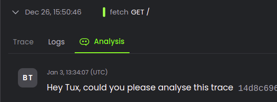
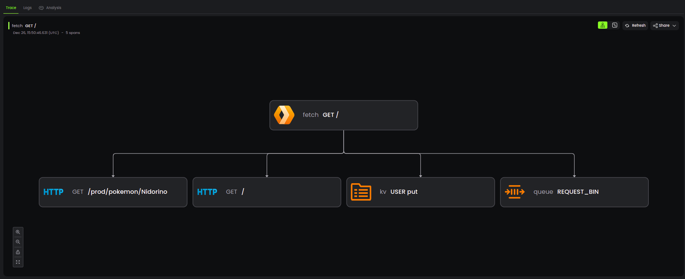
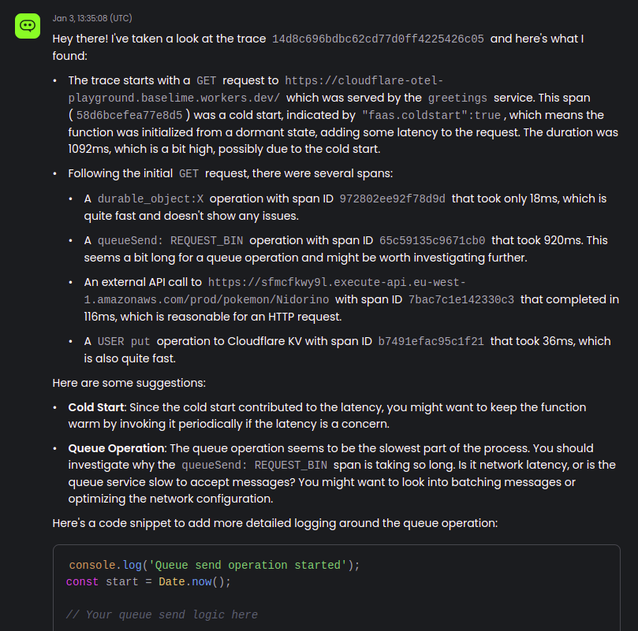

# Tux Quickstart

---

Tux offers an interactive, chat-based interface that enables you ask questions about the behaviour of your applications.

---

## Key Features

You can start a chat with Tux from one of:

- A trace
- A request
- An error

by clicking on the "Analysis" tab.

Tux starts analysing your data within the context you requested it. For example, if you ask for analysis of a trace, Tux will request the trace from Baselime, alongside the associated logs and span events, and also the known shape of your application architecture.

Tux will use this data to give you comprehensive insights into the behaviour of your application, with actionable suggestions and code samples for fixing issues fast.

From there you can ask subsequent questions to delve deeper into the analysis. Tux can run complex queries on your telemetry data and correlate with your application architecture.

---

## Example of Use

- **Error Analysis**: Submit an error and ask Tux to identify the root cause. Follow up with questions about potential fixes.
- **Performance Optimization**: Analyze a trace to understand performance bottlenecks and receive optimization suggestions.

