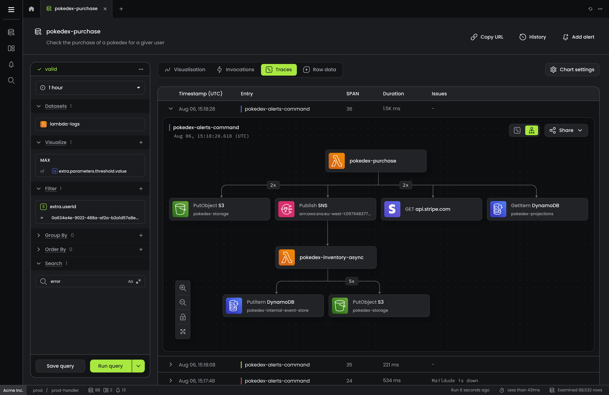

[Baselime](https://baselime.io) is an observability solution built for modern cloud-native environments. It combines logs, metrics, and distributed traces to give you full visibility across your microservices at scale.

Baselime makes it easy to observe your cloud services, containers orchestrators (AWS ECS), and serverless functions. Monitor everything, from latencies to business domain metrics derived from your logs and distributed traces. 

---

## Our mission

Our mission is to simplify the complexity of distributed cloud-native systems. We make observability easy for you such that you can focus on what truly matters: building better products.

---

## How is Baselime different?

Traditional monitoring solutions were built for a world where most applications were single monolithic applications. These solutions lack when it comes to microservices in 3 major ways:
- **Data volume and cardinality**: Microservices generate a higher amounts of data with higher cardinality. The cost of traditional solutions scales exponentially with higher cardinality data.
- **Query speed**: Traditional solutions are typically based on slower data stores, and queries are fast only when your dataset is small.
- **Distributed tracing**: Microservices handle distributed transactions across multiple services and serverless functions. Traditional solutions based on logs struggle to capture the end-to-end transactions.

Baselime directly connects to your cloud account and uses OpenTelemetry to automatically instrument your microservices.

!!!
Do you want to learn more about OpenTelemetry? Start [here](https://opentelemetry.io/).
!!!

Baselime uses our proprietary query engine built on top of ClickHouse, the fastest columnar database in the world. Baselime indexes all your telemetry data, regardless of the cardinality and dimensionality. From day 0, everything is queriable and searchable, and correlation between data sources is a breeze.

Baselime does not perform any pre-aggregation of data before ingestion; this means you can run arbitrary queries on you telemetry data, and get answers about the state of your application, regardless of how unusual or unique this state is.

Moreover, Baselime gives your control over the residency of your data. Either using our backend or a **Bring Your Own Backend** solution where all the data is stored on your cloud account.

---

## Why Baselime?

### Reduce downtime
Troubleshoot infrastructure and application issues with high cardinality data and a fast query enginer.

### Search anything, anywhere. It's all indexed
Query against any nested field and automatically surface anomalies fast; regardless of how unusual or unique this state of your application is.

### Take control of your data and costs
Use or backend or **Bring Your Own Backend**. Up to 6x more value than incumbents. No per-function pricing, no per-seat pricing, no per-alert pricing. Start at $0 and scale up as your applications grow, with no hidden fees.

